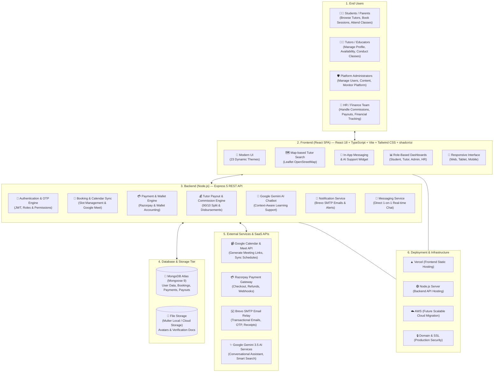
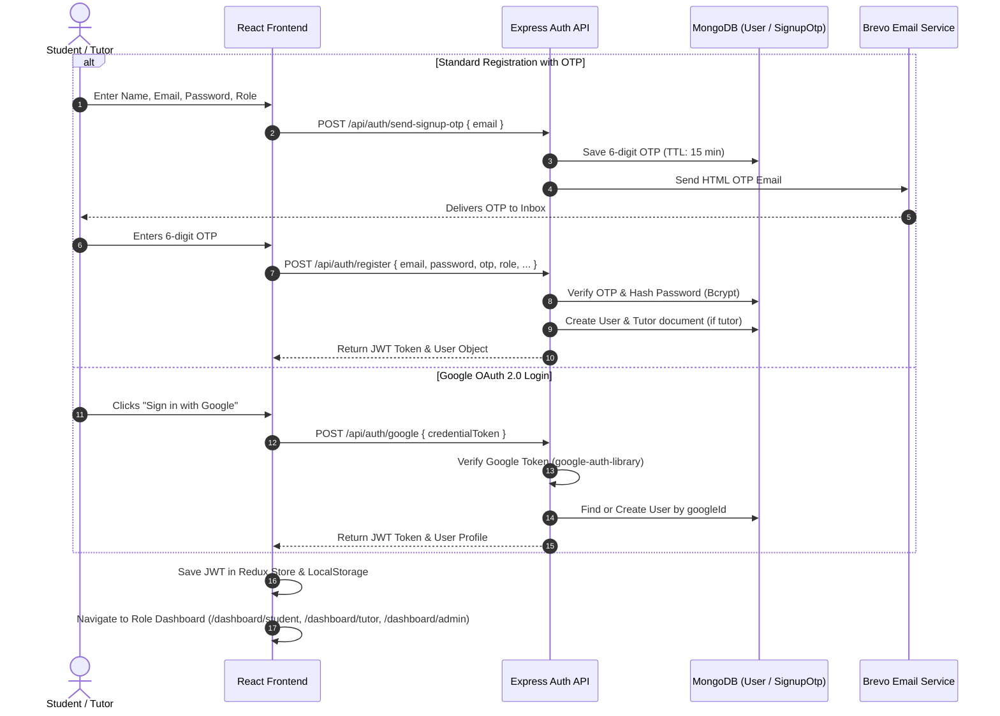
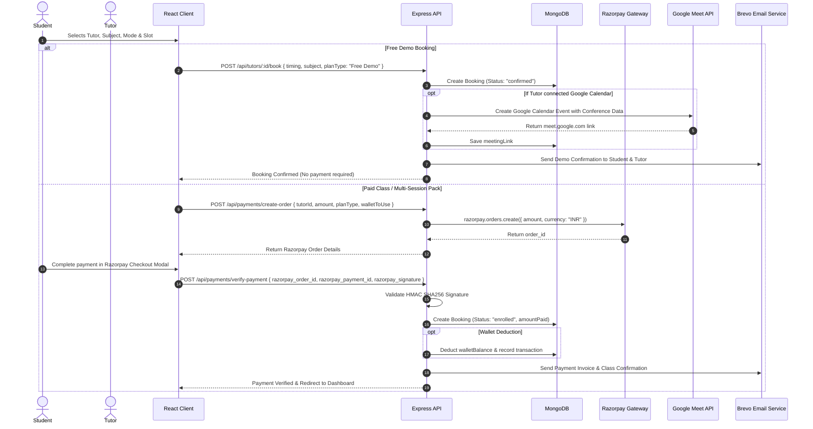
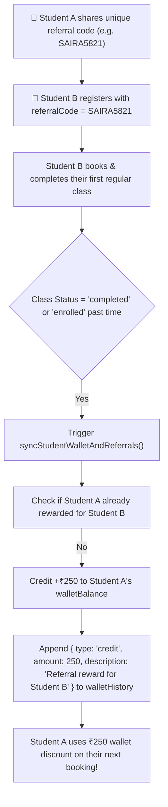
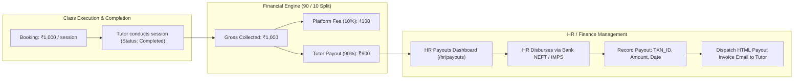
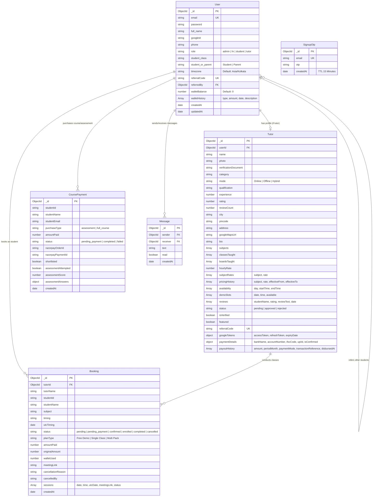
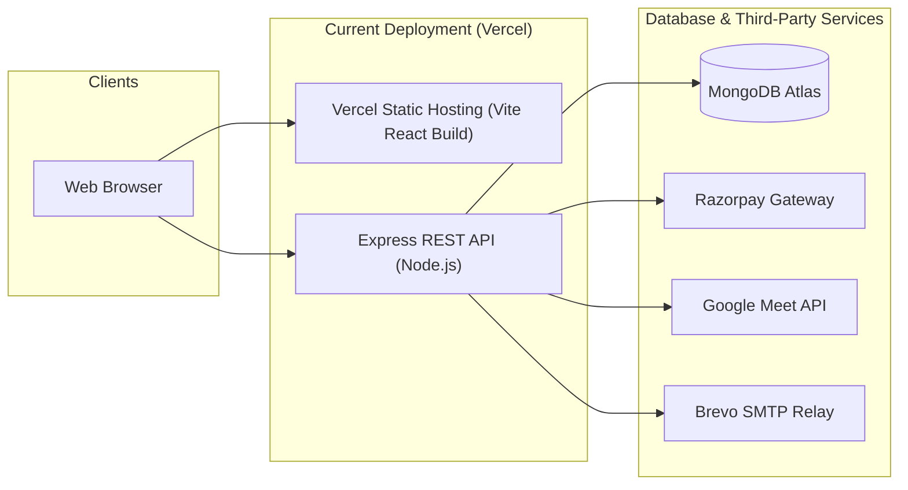

# 🎓 Teach Grow Guide (Cuvasol Tutor) — Hybrid EdTech & Tutor Marketplace Platform

[](https://opensource.org/licenses/ISC)
[](https://reactjs.org/)
[](https://tailwindcss.com/)
[](https://nodejs.org/)
[](https://www.mongodb.com/)
[](https://ai.google.dev/)
[](https://razorpay.com/)
[](https://vercel.com/)

---

## 📖 Table of Contents

1. [Executive Summary & Platform Overview](#-executive-summary--platform-overview)
2. [Core Platform Features](#-core-platform-features)
   - [For Students & Parents](#1-for-students--parents)
   - [For Tutors & Educators](#2-for-tutors--educators)
   - [For Platform Administrators](#3-for-platform-administrators)
   - [For HR & Finance Team](#4-for-hr--finance-team)
   - [AI Future Skills & Online Assessment System](#5-ai-future-skills--online-assessment-system)
   - [Google Gemini-Powered AI Assistant](#6-google-gemini-powered-ai-assistant)
   - [Rich Design & 23 Dynamic Color Themes](#7-rich-design--23-dynamic-color-themes)
3. [End-to-End System Architecture Diagrams](#-end-to-end-system-architecture-diagrams)
   - [High-Level System Topology](#1-high-level-system-topology)
   - [User Authentication & Security Flow](#2-user-authentication--security-flow)
   - [Booking, Payment & Google Meet Lifecycle](#3-booking-payment--google-meet-lifecycle)
   - [Referral & Wallet Accounting Engine](#4-referral--wallet-accounting-engine)
   - [Tutor Payout & Commission Engine](#5-tutor-payout--commission-engine)
4. [Database Architecture & Entity Relationship Diagram (ERD)](#-database-architecture--entity-relationship-diagram-erd)
5. [Complete Technology Stack Inventory](#-complete-technology-stack-inventory)
6. [Repository & Directory Structure](#-repository--directory-structure)
7. [Comprehensive REST API Reference](#-comprehensive-rest-api-reference)
8. [Environment Configuration Reference](#-environment-configuration-reference)
9. [Local Development & Setup Guide](#-local-development--setup-guide)
10. [Deployment & Production Architecture (Vercel & AWS Migration Playbook)](#-deployment--production-architecture-vercel--aws-migration-playbook)
11. [Testing & Quality Assurance](#-testing--quality-assurance)
12. [Troubleshooting & FAQ](#-troubleshooting--faq)

---

## 🌟 Executive Summary & Platform Overview

**Teach Grow Guide (Cuvasol Tutor)** is a modern, full-featured hybrid tutor marketplace and EdTech platform built to connect students and parents with qualified private tutors across academic subjects, competitive exams, and futuristic technical skills (AI, coding, robotics).

The platform handles end-to-end tutoring workflows: from tutor discovery, multi-filter map-based search, dynamic pricing by subject, slot availability scheduling, automated Razorpay payments, wallet credits, Google Meet automated video classroom generation, two-way messaging, automated email alerts via Brevo SMTP, to multi-tier administrative payouts and financial tracking.

```mermaid
graph LR
    subgraph Users["End Users"]
        S[("👨‍🎓 Students / Parents")]
        T[("👩‍🏫 Tutors")]
        A[("🛡️ Admin")]
        H[("💼 HR / Finance")]
    end

    subgraph Frontend["React 18 SPA (Vite + TS + Tailwind)"]
        UI["Modern UI / 23 Dynamic Themes"]
        Map["Leaflet Map Search"]
        Chat["In-App Messaging & AI Widget"]
        Dash["Role-Based Dashboards"]
    end

    subgraph Backend["Express 5 REST API (Node.js)"]
        AuthSvc["Auth & OTP Engine"]
        BookSvc["Booking & Calendar Sync"]
        PaySvc["Razorpay & Wallet Engine"]
        PayoutSvc["HR Commission & Payouts"]
        AISvc["Gemini AI Chatbot Engine"]
    end

    subgraph Data["Database & Storage"]
        Mongo[("MongoDB Atlas (Mongoose 9)")]
        LocalUploads[("Multer Local / S3 Storage")]
    end

    subgraph Cloud["External Services"]
        GMeet["Google Calendar & Meet API"]
        Rzp["Razorpay Payment Gateway"]
        Brevo["Brevo SMTP Email Relay"]
        Gemini["Google Gemini 3.5 AI"]
    end

    Users --> Frontend
    Frontend --> Backend
    Backend --> Data
    Backend --> Cloud
```



---

## 🎯 Core Platform Features

### 1. For Students & Parents
* **Multi-Parameter Tutor Search**: Filter by subject, grade/class (Classes 1–12, College), curriculum board (CBSE, ICSE, IB, State Boards), teaching mode (*Online, Offline At Home, Hybrid*), location/city, price per hour, and tutor rating.
* **Interactive Leaflet Map View**: Geocode tutors by pincode and city to display interactive pins on an OpenStreetMap interface.
* **Tutor Comparison System**: Compare up to 3 tutors side-by-side on qualification, experience, hourly rates, mode, and student ratings.
* **1-Click Free Demo & Class Packs**: Book free introductory demo sessions or recurring multi-week packs with specific schedules.
* **Integrated Timezone Converter**: Automatic local timezone conversion (Asia/Kolkata, UTC, US Eastern, etc.) with real-time countdown to upcoming sessions.
* **Direct 1-on-1 In-App Chat**: Message booked tutors directly with unread counters and message history.
* **Student Referral Wallet**: Unique student referral code. Refer a friend and earn **₹250** platform credit upon their first completed session, automatically redeemable at checkout.
* **Post-Class Rating & Reviews**: Submit detailed star ratings and feedback for verified tutors.

### 2. For Tutors & Educators
* **Verified Tutor Onboarding**: Multi-step registration with ID/degree document uploads, background bio, subjects taught, and experience details.
* **Subject-Wise Dynamic Rates**: Configure specific hourly rates per subject (e.g., Mathematics ₹500/hr, Physics ₹600/hr) with automatic pricing history logs.
* **Granular Availability Scheduler**: Define recurring weekly time windows (e.g., Mon/Wed/Fri 16:00–19:00) and instant demo slots.
* **Google Calendar 2-Way Sync**: Connect Google account with OAuth2 to automatically synchronize bookings and generate instant Google Meet video room links.
* **Tutor Referral Program**: Earn **₹500 cash reward** per student brought to the platform who completes a regular class (up to **₹5,000** bonus earnings).
* **Payout & Banking Hub**: Enter bank account details (Account Number, IFSC, Account Type, Bank Name, UPI ID) and track monthly disbursements with downloadable transaction receipts.

### 3. For Platform Administrators
* **Executive KPI Dashboard**: Real-time metrics for total students, active learners, verified tutors, total bookings, gross platform revenue, AI course revenue, and platform average ratings.
* **Geographic Analytics**: Distribution breakdown of tutors by region (North, South, East, West India) and top cities.
* **Tutor Vetting & Approval Queue**: Review pending tutor applications, inspect uploaded verification certificates, approve/reject with feedback, or toggle "Featured" status.
* **Student & Booking Oversight**: View, search, filter, and manage all student accounts and class bookings across the entire platform.
* **Campaign & Automated Email Dispatch**: Send bulk reminder emails to users with incomplete profiles or broadcast the Tutor Referral Program with 1 click.

### 4. For HR & Finance Team
* **Automated 10% Platform Commission Engine**: Automatic 90/10 split calculation (*90% tutor payout, 10% platform fee*) based on completed sessions and historical rates at time of booking.
* **Disbursement Manager**: Log bank payouts with reference transaction numbers, payment modes (*NEFT/IMPS/UPI*), payment notes, and month periods.
* **Instant Email Payout Receipts**: Dispatch styled HTML payout invoices directly to tutors upon recording disbursement.
* **Bank Details Setup Reminders**: Automated 1-click reminder emails dispatched to all tutors who have pending payouts but have not configured bank details.

### 5. AI Future Skills & Online Assessment System
* **Cohort-Based Curriculum**: Dedicated enrollment portal for AI, Python, Machine Learning, and Prompt Engineering programs for school students.
* **Razorpay Payment Integration**: Streamlined checkout for registration assessment (₹100) and full course enrollment.
* **Automated Assessment Engine**: Timed multi-question technical assessment test with auto-grading, keyword matching, and admin shortlist interface.

### 6. Google Gemini-Powered AI Assistant
* **Embedded AI Chat Widget**: Floating smart chatbot powered by Google Gemini LLM (`gemini-3.5-flash-lite` / `gemini-1.5-flash`).
* **Context-Aware Recommendations**: Answers inquiries regarding subject fees, company location (Bangalore), course syllabi, and recommends live approved tutors directly from the database.
* **Graceful Local Fallback**: Keyword-based offline fallback engine if API key quotas are exhausted.

### 7. Rich Design & 23 Dynamic Color Themes
* Curated dark & light themes: `light`, `dark-midnight`, `dark-oled`, `dark-forest`, `dark-purple`, `dark-sunset`, `dark-ocean`, `dark-nordic`, `dark-neon`, `dark-sakura`, `dark-mocha`, `dark-crimson`, `dark-nebula`, `light-blue`, `light-rose`, `light-amber`, `light-lavender`, `light-slate`, `dark-gold`, `dark-coral`, `dark-mint`, `dark-indigo`, `dark-steel`.

---

## 🏗️ End-to-End System Architecture Diagrams

### 1. High-Level System Architecture Diagram



---

### 2. User Authentication & Security Flow



---

### 3. Booking, Payment & Google Meet Lifecycle



---

### 4. Referral & Wallet Accounting Engine



---

### 5. Tutor Payout & Commission Engine



---

## 🗄️ Database Architecture & Entity Relationship Diagram (ERD)



---

## 💻 Complete Technology Stack Inventory

### Frontend Technologies
| Category | Technology / Package | Version | Purpose |
| :--- | :--- | :--- | :--- |
| **Framework & Language** | [React](https://reactjs.org/) & [TypeScript](https://www.typescriptlang.org/) | `18.3.1` / `5.8.3` | Core reactive user interface & static type safety |
| **Build Tooling** | [Vite](https://vitejs.dev/) | `5.4.19` | Ultra-fast HMR and optimized production bundling |
| **Styling & Design System** | [Tailwind CSS](https://tailwindcss.com/) & [PostCSS](https://postcss.org/) | `3.4.17` | Utility-first responsive CSS styling |
| **UI Component Primitives** | [shadcn/ui](https://ui.shadcn.com/) / [Radix UI](https://www.radix-ui.com/) | Latest | Accessible unstyled primitives (Dialog, Dropdown, Tabs, Popover) |
| **State Management** | [Redux Toolkit](https://redux-toolkit.js.org/) & [React-Redux](https://react-redux.js.org/) | `2.11.2` / `9.2.0` | Global state for authentication, role permissions, and active filters |
| **Server State & Caching**| [TanStack React Query](https://tanstack.com/query) | `5.83.0` | Async server cache, auto revalidation, and loading states |
| **HTTP Client** | [Axios](https://axios-http.com/) | `1.13.6` | REST API requests with request/response health interceptors |
| **Animations** | [Framer Motion](https://www.framer.com/motion/) | `12.35.2` | Fluid page transitions, modal reveals, and floating widgets |
| **Map & Geocoding** | [Leaflet](https://leafletjs.com/) & [React-Leaflet](https://react-leaflet.js.org/) | `1.9.4` | Interactive OpenStreetMap for tutor geo-visualization |
| **Data Visualization** | [Recharts](https://recharts.org/) | `2.15.4` | Admin KPI charts (Regional distribution, city density, revenue) |
| **Notifications & Toast** | [Sonner](https://sonner.emilkowal.ski/) | `1.7.4` | Rich interactive toast alerts for bookings and actions |
| **Icons** | [Lucide React](https://lucide.dev/) | `0.462.0` | Clean, modern feather-based icon set |
| **Date & Time** | [date-fns](https://date-fns.org/) | `3.6.0` | Timezone conversions, slot formatting, and countdown calculations |
| **Forms & Validation** | [React Hook Form](https://react-hook-form.com/) & [Zod](https://zod.dev/) | `7.61.1` / `3.25.76` | Type-safe form schemas, input masking, and error handling |

### Backend Technologies
| Category | Technology / Package | Version | Purpose |
| :--- | :--- | :--- | :--- |
| **Runtime & Framework** | [Node.js](https://nodejs.org/) & [Express](https://expressjs.com/) | `v18+` / `5.2.1` | Asynchronous RESTful API server & routing |
| **Database & ODM** | [MongoDB Atlas](https://www.mongodb.com/) & [Mongoose](https://mongoosejs.com/) | `9.3.0` | Document database schema validation, models, and queries |
| **Authentication & Hash** | [jsonwebtoken (JWT)](https://github.com/auth0/node-jsonwebtoken) & [bcryptjs](https://github.com/dcodeIO/bcrypt.js) | `9.0.3` / `3.0.3` | Bearer token authorization and salt password hashing |
| **OAuth & Google APIs** | [googleapis](https://github.com/googleapis/google-api-nodejs-client) & [google-auth-library](https://github.com/googleapis/google-auth-library-nodejs) | `176.0.0` / `10.6.2` | Google Sign-in verification & Google Meet link generation |
| **Artificial Intelligence**| [@google/generative-ai](https://www.npmjs.com/package/@google/generative-ai) | `0.24.1` | Google Gemini 3.5 LLM integration for the support chatbot |
| **Payment Gateway** | [Razorpay Node SDK](https://razorpay.com/docs/payments/server-integration/nodejs/) | `2.9.6` | Order generation, HMAC signature verification, and webhook handling |
| **Email Relay** | [Nodemailer](https://nodemailer.com/) | `8.0.7` | SMTP transport (Brevo / Sendinblue) for OTP, booking, and payouts |
| **File Uploads** | [Multer](https://github.com/expressjs/multer) | `2.1.1` | Multi-part form data processing for profile photos & ID documents |
| **Cross-Origin Security** | [CORS](https://github.com/expressjs/cors) & [dotenv](https://github.com/motdotla/dotenv) | `2.8.6` / `17.3.1` | Origin whitelist filtering and environment variable configuration |

---

## 📁 Repository & Directory Structure

```text
teach-grow-guide/
├── AWS_MIGRATION_GUIDE.md          # Complete step-by-step AWS deployment playbook
├── Brevo_DNS_Instructions.md       # SPF/DKIM DNS instructions for Brevo email deliverability
├── README.md                       # Comprehensive platform architecture & setup documentation
├── package.json                    # Frontend dependencies & npm scripts
├── vite.config.ts                  # Vite build and plugin configurations
├── tailwind.config.ts              # Tailwind CSS theme configuration and tokens
├── tsconfig.json                   # TypeScript project root configuration
│
├── backend/                        # Express.js REST API Backend
│   ├── Dockerfile                  # Production container definition for containerized deployments
│   ├── index.js                    # Express app entrypoint, CORS, MongoDB connection & routes
│   ├── package.json                # Backend dependencies & npm scripts
│   ├── routes/                     # API Route Handlers
│   │   ├── authRoutes.js           # Signup, OTP, Login, Google OAuth, Password Reset, Calendar Sync
│   │   ├── tutorRoutes.js          # Tutor directory, profile editing, slot booking, reviews
│   │   ├── dashboardRoutes.js      # Admin analytics, Student dashboard, Tutor metrics, HR Payouts
│   │   ├── paymentRoutes.js        # Razorpay orders, payment verification, course enrollment
│   │   ├── messageRoutes.js        # Direct 1-on-1 chat history and inbox conversations
│   │   ├── uploadRoutes.js         # File upload endpoints for photos and credentials
│   │   └── chatbotRoutes.js        # Gemini AI Assistant endpoint with fallback logic
│   ├── schemas/                    # Mongoose Data Schemas & Models
│   │   ├── userSchema.js           # User profiles, roles, referral codes, wallet transactions
│   │   ├── tutorSchema.js          # Tutor bios, subjects, rates, availability, bank & payout info
│   │   ├── bookingSchema.js        # Class bookings, multi-session packs, Google Meet links
│   │   ├── coursePaymentSchema.js  # AI Course enrollments, assessments & test scores
│   │   ├── messageSchema.js        # In-app chat messages between users
│   │   ├── signupOtpSchema.js      # Short-lived OTP documents with TTL indexes
│   │   └── uploadSchema.js         # Uploaded file metadata
│   ├── utils/                      # Helper Utilities & External Services
│   │   ├── emailService.js         # Nodemailer HTML email templates & SMTP dispatchers
│   │   ├── googleMeetService.js    # Google Calendar & Meet video conference API generator
│   │   ├── referralWalletHelper.js # Multi-tier referral accounting and wallet balance sync
│   │   └── urlHelper.js            # Dynamic asset URL resolving for local/cloud environments
│   ├── scripts/                    # Database Seed & Administrative Utilities
│   │   ├── createAdmin.js          # Script to create initial administrator account
│   │   ├── createHRAccount.js      # Script to create dedicated HR/Finance account
│   │   ├── seedTutor.js            # Seed sample verified tutors with subjects and rates
│   │   └── getAdminRefreshToken.js # Utility to generate Google Calendar refresh token
│   └── uploads/                    # Local storage directory for avatars and verification docs
│
├── src/                            # React + TypeScript Frontend Application
│   ├── App.tsx                     # Main router, network interceptors, theme wrapper
│   ├── main.tsx                    # React DOM root entrypoint & Redux store provider
│   ├── index.css                   # Tailwind base imports, animations, and CSS variables
│   ├── components/                 # Reusable UI Components
│   │   ├── chat/                   # In-app chat panel and conversation list
│   │   ├── home/                   # Home page hero, consultation modal, options section
│   │   ├── layout/                 # Header, Footer, PageLayout, ThemeSwitcher (23 themes)
│   │   ├── tutors/                 # TutorCard, TutorComparisonModal, TutorMapView
│   │   └── ui/                     # shadcn/ui components (Button, Dialog, Badge, Toaster)
│   ├── config/                     # Client Configuration
│   │   └── api.ts                  # Dynamic API base URL resolver (VITE_API_URL fallback)
│   ├── contexts/                   # React Context Providers
│   │   └── AuthContext.tsx         # User authentication session and role helpers
│   ├── redux/                      # Redux Toolkit Store
│   │   ├── store.ts                # Store initialization
│   │   └── slices/                 # Redux slices (authSlice, dashboardSlice)
│   ├── pages/                      # Application Page Views & Routes
│   │   ├── Index.tsx               # Homepage with featured tutors, subjects, and testimonials
│   │   ├── BrowseTutors.tsx        # Search, filter, map view, and comparison of tutors
│   │   ├── TutorProfile.tsx        # Detailed tutor profile, booking widget & calendar
│   │   ├── Login.tsx               # Sign in with email or Google OAuth
│   │   ├── RegisterStudent.tsx     # Student registration with OTP email validation
│   │   ├── RegisterTutor.tsx       # Tutor registration with document uploads
│   │   ├── AIFutureSkills.tsx      # AI Program overview, syllabus, and enrollment
│   │   ├── AIAssessment.tsx        # Timed online coding/AI assessment quiz
│   │   ├── Contact.tsx             # Contact form and office location details
│   │   ├── About.tsx               # About Cuvasol Tutor and mission statement
│   │   └── dashboard/              # Role-Based Protected Dashboards
│   │       ├── StudentDashboard.tsx# Classes, bookings, wallet credits, messaging
│   │       ├── TutorDashboard.tsx  # Classes, availability timings, pricing, bank payouts
│   │       ├── AdminDashboard.tsx  # Analytics, tutor approvals, user management, campaigns
│   │       └── HRDashboard.tsx     # Tutor payout ledger, commission reports, reminder emails
│   └── utils/                      # Frontend Helpers
│       ├── geocoding.ts            # Indian city and pincode geocoding coordinates
│       ├── timezone.ts             # Date and timezone conversion utilities
│       └── meeting.ts              # Google Meet link parsing and deep link generators
│
└── public/                         # Static Assets, Favicons, and SEO Robots.txt
```

---

## 📡 Comprehensive REST API Reference

### 🔐 Authentication & Profile Routes (`/api/auth`)
| Method | Endpoint | Description | Access |
| :--- | :--- | :--- | :--- |
| `POST` | `/api/auth/send-signup-otp` | Generate and email 6-digit verification OTP | Public |
| `POST` | `/api/auth/register` | Complete student/tutor registration with OTP validation | Public |
| `POST` | `/api/auth/login` | Authenticate with email/password and obtain JWT | Public |
| `POST` | `/api/auth/google` | Sign-in or register using Google OAuth2 ID token | Public |
| `POST` | `/api/auth/forgot-password` | Dispatch password reset OTP to email | Public |
| `POST` | `/api/auth/reset-password` | Verify reset OTP and update account password | Public |
| `PUT` | `/api/auth/profile/:id` | Update user profile details and timezone | Authenticated |
| `POST` | `/api/auth/contact` | Submit general contact message and dispatch email | Public |
| `GET` | `/api/auth/google-calendar/url` | Get Google OAuth authorization URL for Calendar sync | Tutor |
| `POST` | `/api/auth/google-calendar/save-tokens` | Exchange code and save Google tokens to tutor profile | Tutor |
| `GET` | `/api/auth/google-calendar/status` | Check if tutor's Google Calendar is connected | Tutor |
| `POST` | `/api/auth/google-calendar/disconnect` | Remove Google Calendar integration tokens | Tutor |

---

### 👨‍🏫 Tutor & Booking Routes (`/api/tutors`)
| Method | Endpoint | Description | Access |
| :--- | :--- | :--- | :--- |
| `GET` | `/api/tutors` | Search and filter tutors by subject, mode, city, rating, rate | Public |
| `GET` | `/api/tutors/:id` | Get single tutor profile with subjects, rates, reviews | Public |
| `GET` | `/api/tutors/user/:userId` | Get tutor profile linked to a specific user account ID | Authenticated |
| `POST` | `/api/tutors/:id/book` | Book a free demo or standard single session | Student |
| `POST` | `/api/tutors/:id/book-class` | Book a multi-week/multi-session pack with specific days | Student |
| `POST` | `/api/tutors/:id/slots` | Add or update custom demo slots | Tutor |
| `GET` | `/api/tutors/:id/bookings/student/:studentId` | Get past booking history between student and tutor | Student / Tutor |
| `PUT` | `/api/tutors/booking/:bookingId/status` | Update booking status (`confirmed`, `cancelled`, `completed`) | Student / Tutor |
| `PUT` | `/api/tutors/booking/:bookingId/session/:sessionIdx/status` | Mark individual session in a pack as completed/cancelled | Tutor / Admin |
| `POST` | `/api/tutors/booking/:bookingId/approve` | Student approves class confirmation | Student |
| `PUT` | `/api/tutors/:id/profile` | Update tutor bio, subject rates, city, and address | Tutor |
| `PUT` | `/api/tutors/:id/payment-details` | Update bank account & UPI information for payouts | Tutor |
| `POST` | `/api/tutors/:id/rate` | Submit review and star rating for a completed tutor class | Student |
| `PUT` | `/api/tutors/:id/admin` | Admin approves/rejects application, updates rates | Admin |
| `DELETE` | `/api/tutors/:id/admin` | Admin permanently deletes a tutor profile | Admin |

---

### 💳 Payments & AI Course Routes (`/api/payments`)
| Method | Endpoint | Description | Access |
| :--- | :--- | :--- | :--- |
| `POST` | `/api/payments/create-order` | Create Razorpay order for tutor class or multi-pack | Student |
| `POST` | `/api/payments/verify-payment` | Verify Razorpay HMAC signature & enroll student in class | Student |
| `POST` | `/api/payments/create-course-order` | Create Razorpay order for AI Future Skills program | Student |
| `POST` | `/api/payments/verify-course-payment` | Verify AI program order & grant assessment access | Student |
| `GET` | `/api/payments/assessment/:paymentId` | Get assessment questions for paid student | Student |
| `POST` | `/api/payments/assessment/:paymentId/submit` | Submit assessment answers & auto-grade | Student |
| `POST` | `/api/payments/shortlist-student` | Admin shortlists student for AI cohort admission | Admin |

---

### 📊 Dashboard & Payouts Routes (`/api/dashboard`)
| Method | Endpoint | Description | Access |
| :--- | :--- | :--- | :--- |
| `GET` | `/api/dashboard/admin` | Admin executive KPIs, regional stats, and city breakdown | Admin |
| `GET` | `/api/dashboard/admin/bookings` | Retrieve all platform bookings with populated details | Admin |
| `GET` | `/api/dashboard/admin/students` | Retrieve all registered student accounts | Admin |
| `DELETE` | `/api/dashboard/admin/students/:id` | Delete student and their associated bookings | Admin |
| `GET` | `/api/dashboard/student/:studentId` | Student metrics, wallet balance, and referral stats | Student |
| `GET` | `/api/dashboard/student/:studentId/bookings` | Student booking history with meeting links | Student |
| `GET` | `/api/dashboard/tutor/:tutorId` | Tutor earnings, active students, availability, referrals | Tutor |
| `GET` | `/api/dashboard/tutor/:tutorId/bookings` | Tutor class requests and booking list | Tutor |
| `PUT` | `/api/dashboard/tutor/:tutorId/timings` | Update tutor weekly schedule timings | Tutor |
| `GET` | `/api/dashboard/admin/payouts` | Complete tutor payouts ledger with 90/10 commission split | Admin |
| `GET` | `/api/dashboard/hr/payouts` | HR finance tutor payouts ledger and disbursement status | Admin / HR |
| `POST` | `/api/dashboard/admin/payouts/record` | Log payout disbursement & send receipt email | Admin |
| `POST` | `/api/dashboard/hr/payouts/record` | HR logs payout disbursement & sends receipt email | Admin / HR |
| `POST` | `/api/dashboard/hr/send-bank-reminder` | Send 1-click email reminder to tutors missing bank info | Admin / HR |
| `POST` | `/api/dashboard/admin/send-profile-emails` | Broadcast reminder to users with incomplete profiles | Admin |
| `POST` | `/api/dashboard/admin/send-referral-emails` | Broadcast tutor referral program announcement | Admin |

---

### 💬 Messaging & AI Chatbot Routes (`/api/messages` & `/api/chatbot`)
| Method | Endpoint | Description | Access |
| :--- | :--- | :--- | :--- |
| `POST` | `/api/messages` | Send direct message to student or tutor | Authenticated |
| `GET` | `/api/messages/chat/:userId1/:userId2` | Get full message conversation history between two users | Authenticated |
| `GET` | `/api/messages/inbox/:userId` | Get inbox conversations with latest message & unread count | Authenticated |
| `POST` | `/api/chatbot` | Conversational query to Google Gemini AI Support Assistant | Public |

---

## ⚙️ Environment Configuration Reference

### 1. Backend Environment Variables (`backend/.env`)

```ini
# Server Configuration
NODE_ENV=development
PORT=5000
FRONTEND_URL=http://localhost:8080,http://localhost:5173
BACKEND_URL=http://localhost:5000

# Database
MONGO_URI=mongodb+srv://<username>:<password>@cluster0.mongodb.net/teachgrow?retryWrites=true&w=majority

# Security
JWT_SECRET=your_super_secret_jwt_encryption_key_here

# Payment Gateway (Razorpay)
RAZORPAY_KEY_ID=rzp_test_your_razorpay_key_id
RAZORPAY_KEY_SECRET=your_razorpay_key_secret
RAZORPAY_WEBHOOK_SECRET=your_optional_webhook_secret

# Google OAuth & Calendar / Google Meet Integration
GOOGLE_CLIENT_ID=your_google_client_id.apps.googleusercontent.com
GOOGLE_CLIENT_SECRET=your_google_client_secret
GOOGLE_REDIRECT_URI=http://localhost:8080/google-callback
ADMIN_GOOGLE_REFRESH_TOKEN=1//04your_admin_google_refresh_token
ADMIN_EMAIL=support@cuvasol.com

# Email Relay (Brevo / Sendinblue SMTP)
SMTP_HOST=smtp-relay.brevo.com
SMTP_PORT=587
SMTP_USER=your_brevo_smtp_login
SMTP_PASS=your_brevo_smtp_master_password
EMAIL_FROM="Cuvasol Tutor" <support@cuvasol.com>

# Google Gemini AI Assistant
GEMINI_API_KEY=AIzaSyYourGoogleGeminiApiKey

# Tutor Payouts
# AES-256 key encrypting tutor bank account numbers at rest. Required before a
# tutor can submit payout details -- the endpoint refuses rather than storing an
# account number in the clear. Generate with:
#   node -e "console.log(require('crypto').randomBytes(32).toString('hex'))"
PAYOUT_ENCRYPTION_KEY=your_64_character_hex_key

# Platform share of collected amounts, as a fraction. 0.10 = the current 90/10
# split in the tutor's favour. Each payout record stores the rate actually
# applied, so changing this never rewrites history.
PLATFORM_COMMISSION_RATE=0.10

# Payouts below this are held rather than transferred, so a tiny amount does not
# cost more in bank fees than it is worth. 0 disables the rule.
MINIMUM_PAYOUT_AMOUNT=0

# Whether a single class still marked 'enrolled' counts as delivered once its
# scheduled time has passed. Defaults to false: a passed timeslot is not
# evidence the class happened, and paying on that basis over-pays. Amounts held
# back this way are reported as "unconfirmed" rather than dropped.
COUNT_PAST_ENROLLED_AS_DELIVERED=false
```

### 2. Frontend Environment Variables (`.env` or `.env.production`)

```ini
# Public API Endpoint
VITE_API_URL=http://localhost:5000/api

# Google OAuth Web Client ID
VITE_GOOGLE_CLIENT_ID=your_google_client_id.apps.googleusercontent.com
```

---

## 🚀 Local Development & Setup Guide

### Prerequisites
* **Node.js**: `v18.0.0` or higher (`v20 LTS` recommended)
* **npm** or **bun**: `npm v9+` / `bun v1.0+`
* **MongoDB**: Local MongoDB instance or free cloud cluster on [MongoDB Atlas](https://www.mongodb.com/cloud/atlas)

---

### Step 1: Clone the Repository
```bash
git clone https://github.com/sairam0043/teach-grow-guide.git
cd teach-grow-guide
```

---

### Step 2: Configure Backend & Install Dependencies
```bash
# Navigate to backend directory
cd backend

# Install dependencies
npm install

# Create and populate environment file
cp .env.example .env
# Open .env and fill in your MONGO_URI, JWT_SECRET, RAZORPAY keys, and SMTP credentials
```

---

### Step 3: Seed Database with Initial Admin & Tutors (Optional)
```bash
# Seed initial administrator account (admin@cuvasol.com / AdminPass123!)
node scripts/createAdmin.js

# Seed sample approved tutors with subjects and rates
node scripts/seedTutor.js
```

---

### Step 4: Start the Backend Development Server
```bash
# Start backend in development mode with nodemon
npm run dev
# Server listening on http://localhost:5000
```

---

### Step 5: Configure Frontend & Start Vite Dev Server
Open a new terminal window in the project root (`teach-grow-guide`):

```bash
# Install frontend dependencies
npm install

# Start Vite frontend server
npm run dev
# Vite server running on http://localhost:8080 (or http://localhost:5173)
```

---

## 🚀 Deployment & Production Architecture (Vercel & AWS Migration Playbook)

### 1. Current Deployment Architecture (Vercel & Node.js)

The platform is configured to run smoothly on **Vercel** as well as standard **Node.js / Docker** hosting:
* **Frontend**: Static SPA hosted via Vercel Edge with `vercel.json` rewrite routing (`/*` $\rightarrow$ `/index.html`).
* **Backend**: Express.js REST API running as a continuous Node.js server (port 5000) or as a Vercel serverless function (`backend/vercel.json`).
* **Database**: Managed MongoDB Atlas cloud cluster.



### 2. Deployment Commands Quick Reference

#### Frontend Production Build:
```bash
npm run build
# Outputs optimized static bundle to dist/
```

#### Running Backend in Production:
```bash
cd backend
npm start
# Or using PM2 process manager
pm2 start index.js --name "teach-grow-api"
```

#### Containerized Build (Docker):
```bash
cd backend
docker build -t teach-grow-backend:latest .
docker run -p 5000:5000 --env-file .env teach-grow-backend:latest
```

### 3. Target AWS Production Architecture (Optional Migration)

If you plan to migrate the platform from Vercel to Amazon Web Services (AWS) for dedicated compute and scaling, a complete, step-by-step infrastructure migration playbook is available in:
👉 [**AWS_MIGRATION_GUIDE.md**](./AWS_MIGRATION_GUIDE.md)

---

## 🧪 Testing & Quality Assurance

The codebase includes automated unit, component, and end-to-end integration tests:

### Running Unit & Component Tests (Vitest)
```bash
# Run test suite once
npm run test

# Run tests in watch mode
npm run test:watch
```

### Running End-to-End Browser Tests (Playwright)
```bash
# Run Playwright E2E test specs across Chromium, Firefox & WebKit
npx playwright test
```

### Code Quality & Linting (ESLint)
```bash
npm run lint
```

---

## ❓ Troubleshooting & FAQ

<details>
<summary><strong>1. Why is the frontend showing a "Temporary Network Issue" alert?</strong></summary>

The frontend includes an automatic health check interceptor in `App.tsx`. If the backend API at `VITE_API_URL/health` cannot be reached or returns a `500+` status code, the alert is displayed with a "Try Again" retry button.
* Verify your backend is running (`npm run dev` in `backend/`).
* Ensure `VITE_API_URL` in your `.env` points to the correct backend port (e.g. `http://localhost:5000/api`).
* Check CORS configuration in `backend/index.js` allows your frontend's port/domain.
</details>

<details>
<summary><strong>2. How do I generate Google Meet links automatically for booked classes?</strong></summary>

1. Create a Google Cloud Project with the **Google Calendar API** enabled.
2. Configure OAuth Consent Screen and create OAuth2 Web Client credentials.
3. Tutors navigate to their **Tutor Dashboard** and click **"Connect Google Calendar"**.
4. Once authenticated, any accepted booking with that tutor will automatically invoke Google Calendar's `conferenceData` API to generate a `meet.google.com/xxx-yyyy-zzz` link.
</details>

<details>
<summary><strong>3. How does the 90/10 tutor payout calculation work?</strong></summary>

The financial engine calculates tutor payouts dynamically:
* Every enrolled/completed session is tracked against the tutor's historical subject rate at the time of booking.
* The platform automatically retains **10% as platform commission**.
* **90%** of collected revenue is made available for tutor withdrawal.
* HR and Admin can view pending versus disbursed amounts, log transaction IDs, and dispatch automated HTML receipts.
</details>

---

## 📄 License & Maintainers

* **Platform**: Cuvasol Tutor / Teach Grow Guide
* **License**: [ISC License](https://opensource.org/licenses/ISC)
* **Support & Contact**: [support@cuvasol.com](mailto:support@cuvasol.com)
* **Headquarters**: WeWork Old Madras Road, Bangalore, Karnataka 560016, India
