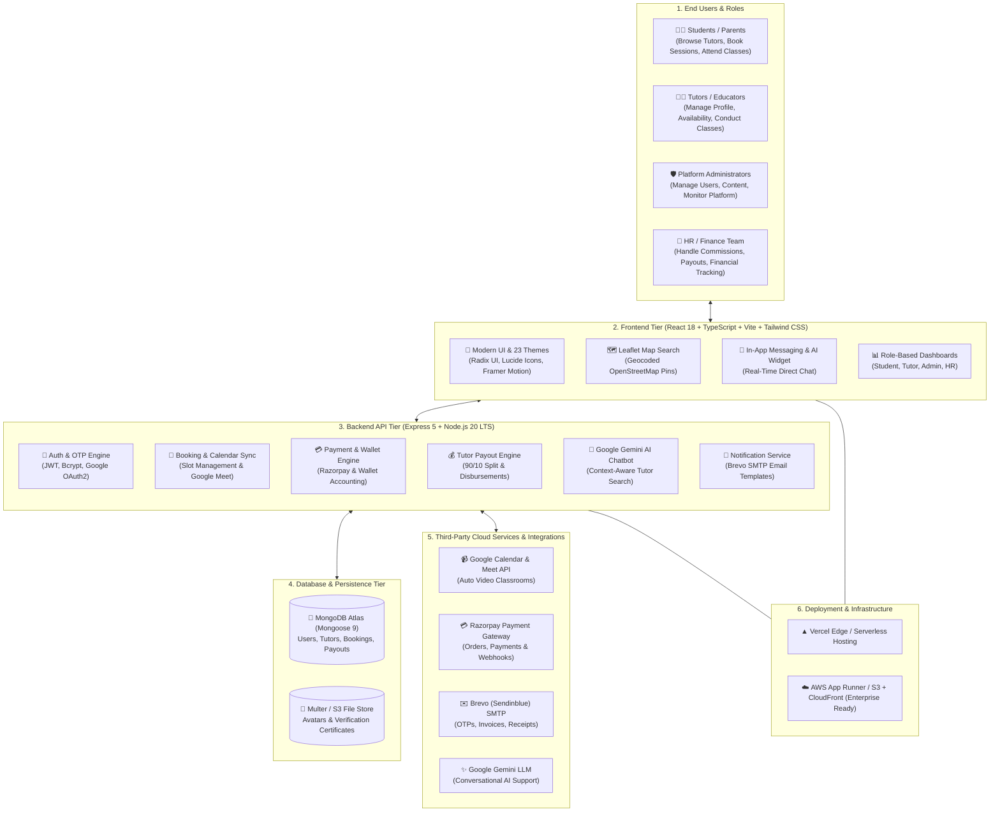
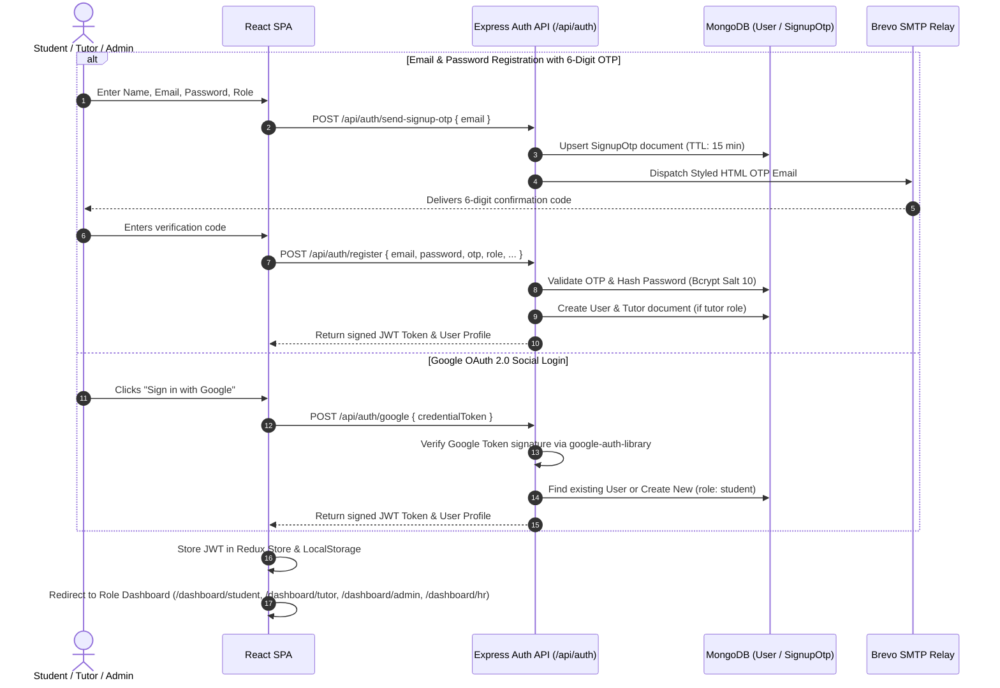
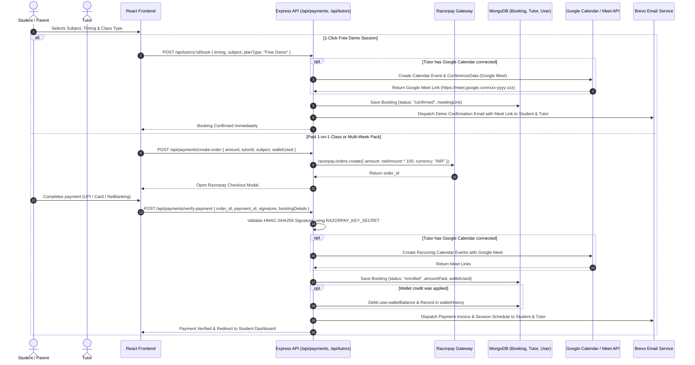
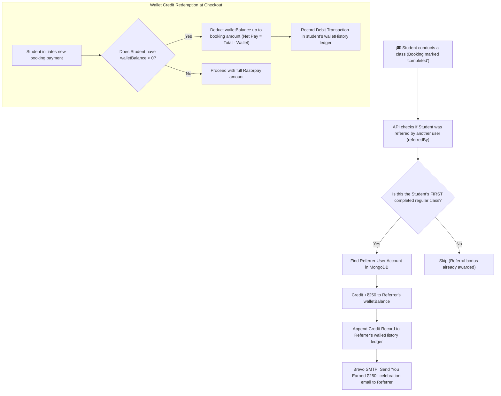
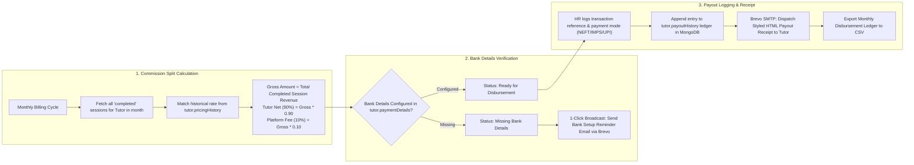
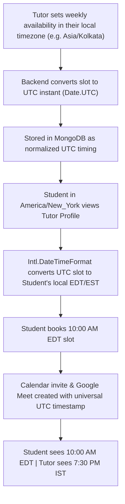
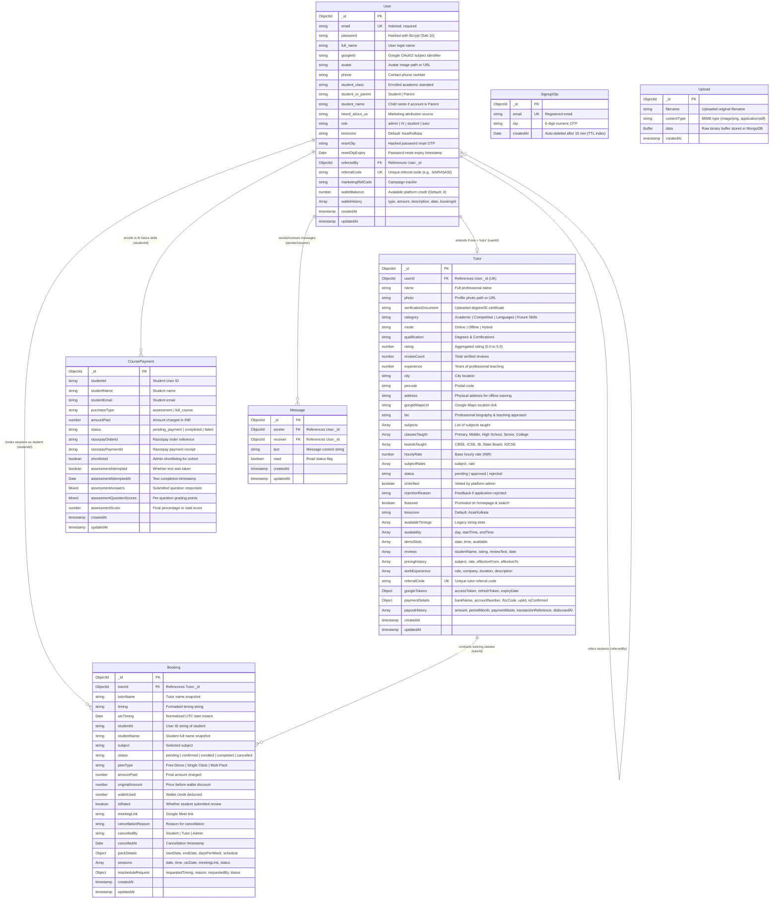

# 🎓 Teach Grow Guide (Cuvasol Tutor) — Hybrid EdTech & Tutor Marketplace Platform

[](https://opensource.org/licenses/ISC)
[](https://reactjs.org/)
[](https://tailwindcss.com/)
[](https://nodejs.org/)
[](https://www.mongodb.com/)
[](https://ai.google.dev/)
[](https://razorpay.com/)
[](https://meet.google.com/)
[%20SMTP-0B99FF?logo=sendinblue&logoColor=white)](https://www.brevo.com/)
[](https://vercel.com/)

---

## 📖 Table of Contents

1. [Executive Summary & Platform Overview](#-executive-summary--platform-overview)
2. [Core Platform Features by Role](#-core-platform-features-by-role)
   - [For Students & Parents](#1-for-students--parents)
   - [For Tutors & Educators](#2-for-tutors--educators)
   - [For Platform Administrators](#3-for-platform-administrators)
   - [For HR & Finance Team](#4-for-hr--finance-team)
   - [AI Future Skills Cohort & Online Assessment System](#5-ai-future-skills-cohort--online-assessment-system)
   - [Google Gemini-Powered Context-Aware AI Chatbot](#6-google-gemini-powered-context-aware-ai-chatbot)
   - [Rich UI Design System & 23 Dynamic Color Themes](#7-rich-ui-design-system--23-dynamic-color-themes)
3. [End-to-End System Architecture & Lifecycle Diagrams](#-end-to-end-system-architecture--lifecycle-diagrams)
   - [6-Tier Fullstack System Topology](#1-6-tier-fullstack-system-topology)
   - [User Authentication, OTP Verification & Google OAuth2 Security Flow](#2-user-authentication-otp-verification--google-oauth2-security-flow)
   - [Booking, Razorpay Payment & Google Meet Automation Lifecycle](#3-booking-razorpay-payment--google-meet-automation-lifecycle)
   - [Student Referral & Wallet Accounting Engine](#4-student-referral--wallet-accounting-engine)
   - [HR Financial Commission (90/10 Split) & Payout Disbursement Flow](#5-hr-financial-commission-9010-split--payout-disbursement-flow)
   - [Timezone Conversion & Scheduling Engine](#6-timezone-conversion--scheduling-engine)
4. [Database Architecture & Entity Relationship Diagram (ERD)](#-database-architecture--entity-relationship-diagram-erd)
   - [Mermaid Entity Relationship Diagram (ERD)](#database-erd)
   - [Data Models & Schema Specifications](#data-models--schema-specifications)
5. [Complete Technology Stack Inventory](#-complete-technology-stack-inventory)
6. [Repository & Monorepo Directory Structure](#-repository--monorepo-directory-structure)
7. [Comprehensive REST API Reference](#-comprehensive-rest-api-reference)
   - [Authentication Endpoints (`/api/auth`)](#1-authentication-endpoints-apiauth)
   - [Tutor Management Endpoints (`/api/tutors`)](#2-tutor-management-endpoints-apitutors)
   - [Dashboard & Analytics Endpoints (`/api/dashboard`)](#3-dashboard--analytics-endpoints-apidashboard)
   - [Payments & AI Course Endpoints (`/api/payments`)](#4-payments--ai-course-endpoints-apipayments)
   - [Direct Chat & Messaging Endpoints (`/api/messages`)](#5-direct-chat--messaging-endpoints-apimessages)
   - [Gemini AI Chatbot Endpoints (`/api/chatbot`)](#6-gemini-ai-chatbot-endpoints-apichatbot)
   - [File Upload Endpoints (`/api/upload`)](#7-file-upload-endpoints-apiupload)
8. [Environment Variables & Configuration Reference](#-environment-variables--configuration-reference)
9. [Local Development & Quickstart Playbook](#-local-development--quickstart-playbook)
10. [Administrative Scripts & Database Seeding CLI](#-administrative-scripts--database-seeding-cli)
11. [Production Deployment Architecture (Vercel & AWS Enterprise Playbook)](#-production-deployment-architecture-vercel--aws-enterprise-playbook)
12. [Testing & Quality Assurance](#-testing--quality-assurance)
13. [Troubleshooting & Operational FAQ](#-troubleshooting--operational-faq)
14. [License & Platform Governance](#-license--platform-governance)

---

## 🌟 Executive Summary & Platform Overview

**Teach Grow Guide (Cuvasol Tutor)** is an enterprise-grade, fullstack hybrid EdTech and tutor marketplace platform engineered to bridge the gap between students/parents seeking tailored 1-on-1 tutoring and verified, high-caliber educators across school curricula, competitive examinations, and futuristic technical domains (Artificial Intelligence, Data Science, Python, and Robotics).

Built with a high-performance **React 18 + TypeScript SPA** frontend and an **Express 5 + Mongoose 9 (Node.js)** backend connected to **MongoDB Atlas**, the platform automates every phase of the educational journey:
* **Tutor Discovery & Filtering**: Real-time multi-dimensional search with geocoded Leaflet OpenStreetMap pins and side-by-side tutor comparisons.
* **Scheduling & Video Classroom Generation**: Google Calendar 2-way OAuth2 synchronization with automated Google Meet video room creation and timezone conversion across global time zones.
* **Frictionless Commerce**: Integrated Razorpay checkout with student referral credits (₹250 reward balance) and automated platform fee deduplication.
* **HR & Financial Governance**: Automated 90/10 commission split engine (90% Tutor / 10% Platform fee), bank detail verification, instant HTML email payment receipts via Brevo SMTP, and single-click reminder broadcasts.
* **AI Future Skills Cohort**: Timed online entrance assessment with auto-grading, keyword matching, student shortlisting, and cohort enrollment tracking.
* **Context-Aware AI Assistant**: Floating smart assistant powered by Google Gemini LLM with real-time live tutor recommendations and graceful offline fallbacks.


```mermaid
graph LR
    subgraph Users["Platform Stakeholders"]
        S[("👨‍🎓 Students / Parents")]
        T[("👩‍🏫 Tutors & Educators")]
        A[("🛡️ Platform Administrators")]
        H[("💼 HR & Finance Team")]
    end

    subgraph Frontend["Frontend Tier (React 18 + Vite + Tailwind)"]
        UI["Modern UI / 23 Themes"]
        Map["Leaflet Map Search"]
        Chat["In-App Messaging & AI Widget"]
        Dash["Role-Based Dashboards"]
    end

    subgraph Backend["Backend API Tier (Express 5 + Node.js 20)"]
        AuthSvc["Auth & OTP Engine"]
        BookSvc["Booking & Calendar Sync"]
        PaySvc["Razorpay & Wallet Ledger"]
        PayoutSvc["HR Commission & Payouts"]
        AISvc["Gemini AI Chatbot Engine"]
    end

    subgraph Storage["Data & Persistence Tier"]
        Mongo[("MongoDB Atlas Cluster")]
        Uploads[("Multer Local / S3 Storage")]
    end

    subgraph Integrations["Third-Party Cloud Services"]
        GMeet["Google Meet & Calendar API"]
        Rzp["Razorpay Payment Gateway"]
        Brevo["Brevo SMTP Email Relay"]
        Gemini["Google Gemini LLM"]
    end

    Users --> Frontend
    Frontend --> Backend
    Backend --> Storage
    Backend --> Integrations
```

---

## 🎯 Core Platform Features by Role

### 1. For Students & Parents
* **Multi-Parameter Search & Filter**: Filter by subject, grade/class (*Class 1–5, 6–8, 9–10, 11–12, College, Competitive Exams*), curriculum board (*CBSE, ICSE, IB, State Board, IGCSE*), teaching mode (*Online, Offline At Home, Hybrid*), city/pincode, budget per hour, and tutor star rating.
* **Interactive Leaflet Map Search**: View nearby verified tutors with interactive OpenStreetMap markers geocoded by city and pincode.
* **Side-by-Side Tutor Comparison**: Select and compare up to 3 tutors simultaneously across qualifications, experience, hourly rates, teaching mode, and student ratings.
* **1-Click Free Demos & Recurring Packs**: Book introductory 30-minute free demo classes or recurring multi-week packs with custom schedules.
* **Global Timezone Converter**: Automatic browser timezone detection with manual switching (Asia/Kolkata, UTC, US Eastern, etc.), countdown timers, and timezone-adjusted class dates.
* **Direct 1-on-1 In-App Chat**: Communicate directly with booked tutors with unread counters, live message polling, and conversation histories.
* **Student Referral Wallet (₹250 Platform Credit)**: Share unique student referral codes. Earn **₹250 credit** automatically when a referred student completes their first regular class, redeemable during Razorpay checkout.
* **Post-Class Rating & Reviews**: Submit detailed 5-star ratings and written reviews for verified tutors upon session completion.

### 2. For Tutors & Educators
* **Multi-Step Onboarding & Verification**: Complete profile setup with ID/degree document uploads, background bio, subjects taught, and experience history.
* **Subject-Wise Dynamic Rates**: Set distinct hourly rates for different subjects (e.g., *Mathematics ₹500/hr, Physics ₹600/hr*) with an automated pricing history ledger.
* **Granular Weekly Availability Scheduler**: Define recurring weekly availability windows (e.g., *Mon/Wed/Fri 16:00–19:00*) and instant demo slots.
* **Google Calendar & Meet 2-Way Sync**: Connect Google account via OAuth2 to automatically schedule classes and issue instant Google Meet video room links.
* **Tutor Referral Program (₹500 Cash Reward)**: Earn **₹500 cash reward** per student brought to the platform who completes a regular class (capped at **₹5,000** bonus earnings).
* **Payout & Banking Hub**: Enter bank account details (Account Number, IFSC, Bank Name, Account Type, UPI ID) and track monthly disbursements with downloadable transaction receipts.

### 3. For Platform Administrators
* **Executive KPI Analytics**: Real-time dashboards monitoring total students, active learners, verified tutors, total bookings, gross platform revenue, AI course revenue, and average satisfaction ratings.
* **Geographic Breakdown**: Visual regional distribution of tutors across North, South, East, and West India, plus top cities.
* **Tutor Vetting & Approval Queue**: Review pending applications, inspect uploaded verification documents, approve/reject with feedback notes, or assign "Featured" status.
* **Student & Booking Oversight**: Comprehensive search, filter, and management interface for all student accounts and bookings across the platform.
* **Automated Email Broadcasts**: Dispatch bulk announcements, campaign emails, or automated profile-completion reminders with a single click.

### 4. For HR & Finance Team
* **Automated 90/10 Platform Commission Engine**: Automatic 90/10 split calculation (*90% tutor payout, 10% platform fee*) based on completed sessions and historical rates at time of booking.
* **Disbursement Manager**: Log bank payouts with reference transaction numbers, payment modes (*NEFT/IMPS/UPI*), payment notes, and month periods.
* **Instant Email Payout Receipts**: Dispatch styled HTML payout invoices directly to tutors upon recording disbursement.
* **Bank Details Setup Reminders**: Automated 1-click reminder emails dispatched to all tutors who have pending payouts but have not configured bank details.
* **CSV Export**: One-click export of monthly tutor payout ledgers for accounting and tax compliance.

### 5. AI Future Skills Cohort & Online Assessment System
* **Specialized Cohort Curriculum**: Dedicated portal for school students enrolling in AI, Python, Machine Learning, and Prompt Engineering programs.
* **Two-Tier Razorpay Checkout**: Streamlined checkout for registration assessment (₹100) and full cohort enrollment.
* **Automated Assessment Engine**: Timed multi-question technical assessment test with auto-grading, keyword matching, and admin shortlist interface.

### 6. Google Gemini-Powered Context-Aware AI Chatbot
* **Embedded AI Chat Widget**: Floating smart chatbot powered by Google Gemini LLM (`gemini-3.5-flash-lite` / `gemini-1.5-flash`).
* **Context-Aware Recommendations**: Answers inquiries regarding subject fees, company location (Bangalore), course syllabi, and recommends live approved tutors directly from the database.
* **Graceful Local Fallback**: Keyword-based offline fallback engine if API key quotas are exhausted.

### 7. Rich UI Design System & 23 Dynamic Color Themes
* Curated dark & light themes powered by `next-themes` and Tailwind CSS: `light`, `dark-midnight`, `dark-oled`, `dark-forest`, `dark-purple`, `dark-sunset`, `dark-ocean`, `dark-nordic`, `dark-neon`, `dark-sakura`, `dark-mocha`, `dark-crimson`, `dark-nebula`, `light-blue`, `light-rose`, `light-amber`, `light-lavender`, `light-slate`, `dark-gold`, `dark-coral`, `dark-mint`, `dark-indigo`, `dark-steel`.

---

## 🏗️ End-to-End System Architecture & Lifecycle Diagrams

### 1. 6-Tier Fullstack System Topology


```mermaid
flowchart TD
    %% LAYER 1: USERS
    subgraph Layer1["1. End Users & Roles"]
        U_Student["👨‍🎓 Students / Parents<br/>(Browse Tutors, Book Sessions, Attend Classes)"]
        U_Tutor["👩‍🏫 Tutors / Educators<br/>(Manage Profile, Availability, Conduct Classes)"]
        U_Admin["🛡️ Platform Administrators<br/>(Manage Users, Content, Monitor Platform)"]
        U_HR["💼 HR / Finance Team<br/>(Handle Commissions, Payouts, Financial Tracking)"]
    end

    %% LAYER 2: FRONTEND SPA
    subgraph Layer2["2. Frontend Tier (React 18 + TypeScript + Vite + Tailwind CSS)"]
        direction TB
        F_UI["🎨 Modern UI & 23 Themes<br/>(Radix UI, Lucide Icons, Framer Motion)"]
        F_Map["🗺️ Leaflet Map Search<br/>(Geocoded OpenStreetMap Pins)"]
        F_Chat["💬 In-App Messaging & AI Widget<br/>(Real-Time Direct Chat)"]
        F_Dash["📊 Role-Based Dashboards<br/>(Student, Tutor, Admin, HR)"]
    end

    %% LAYER 3: BACKEND API
    subgraph Layer3["3. Backend API Tier (Express 5 + Node.js 20 LTS)"]
        direction TB
        B_Auth["🔐 Auth & OTP Engine<br/>(JWT, Bcrypt, Google OAuth2)"]
        B_Book["📅 Booking & Calendar Sync<br/>(Slot Management & Google Meet)"]
        B_Pay["💳 Payment & Wallet Engine<br/>(Razorpay & Wallet Accounting)"]
        B_Payout["💰 Tutor Payout Engine<br/>(90/10 Split & Disbursements)"]
        B_AI["🤖 Google Gemini AI Chatbot<br/>(Context-Aware Tutor Search)"]
        B_Notify["📧 Notification Service<br/>(Brevo SMTP Email Templates)"]
    end

    %% LAYER 4: DATABASE & STORAGE
    subgraph Layer4["4. Database & Persistence Tier"]
        DB_Mongo[("🍃 MongoDB Atlas (Mongoose 9)<br/>Users, Tutors, Bookings, Payouts")]
        DB_Files[("📁 Multer / S3 File Store<br/>Avatars & Verification Certificates")]
    end

    %% LAYER 5: EXTERNAL SERVICES
    subgraph Layer5["5. Third-Party Cloud Services & Integrations"]
        Ext_GMeet["📹 Google Calendar & Meet API<br/>(Auto Video Classrooms)"]
        Ext_Razorpay["💳 Razorpay Payment Gateway<br/>(Orders, Payments & Webhooks)"]
        Ext_Brevo["✉️ Brevo (Sendinblue) SMTP<br/>(OTPs, Invoices, Receipts)"]
        Ext_Gemini["✨ Google Gemini LLM<br/>(Conversational AI Support)"]
    end

    %% LAYER 6: HOSTING & INFRASTRUCTURE
    subgraph Layer6["6. Deployment & Infrastructure"]
        Dep_Vercel["▲ Vercel Edge / Serverless Hosting"]
        Dep_AWS["☁️ AWS App Runner / S3 + CloudFront (Enterprise Ready)"]
    end

    %% CONNECTIVITY
    Layer1 <--> Layer2
    Layer2 <--> Layer3
    Layer3 <--> Layer4
    Layer3 <--> Layer5
    Layer2 --- Layer6
    Layer3 --- Layer6
```

---

### 2. User Authentication, OTP Verification & Google OAuth2 Security Flow


```mermaid
sequenceDiagram
    autonumber
    actor User as Student / Tutor / Admin
    participant UI as React SPA
    participant API as Express Auth API (/api/auth)
    participant DB as MongoDB (User / SignupOtp)
    participant SMTP as Brevo SMTP Relay

    alt Email & Password Registration with 6-Digit OTP
        User->>UI: Enter Name, Email, Password, Role
        UI->>API: POST /api/auth/send-signup-otp { email }
        API->>DB: Upsert SignupOtp document (TTL: 15 min)
        API->>SMTP: Dispatch Styled HTML OTP Email
        SMTP-->>User: Delivers 6-digit confirmation code
        User->>UI: Enters verification code
        UI->>API: POST /api/auth/register { email, password, otp, role, ... }
        API->>DB: Validate OTP & Hash Password (Bcrypt Salt 10)
        API->>DB: Create User & Tutor document (if tutor role)
        API-->>UI: Return signed JWT Token & User Profile
    else Google OAuth 2.0 Social Login
        User->>UI: Clicks "Sign in with Google"
        UI->>API: POST /api/auth/google { credentialToken }
        API->>API: Verify Google Token signature via google-auth-library
        API->>DB: Find existing User or Create New (role: student)
        API-->>UI: Return signed JWT Token & User Profile
    end

    UI->>UI: Store JWT in Redux Store & LocalStorage
    UI->>UI: Redirect to Role Dashboard (/dashboard/student, /dashboard/tutor, /dashboard/admin, /dashboard/hr)
```

---

### 3. Booking, Razorpay Payment & Google Meet Automation Lifecycle


```mermaid
sequenceDiagram
    autonumber
    actor Student as Student / Parent
    actor Tutor as Tutor
    participant UI as React Frontend
    participant API as Express API (/api/payments, /api/tutors)
    participant RZP as Razorpay Gateway
    participant DB as MongoDB (Booking, Tutor, User)
    participant GMeet as Google Calendar / Meet API
    participant SMTP as Brevo Email Service

    Student->>UI: Selects Subject, Timing & Class Type
    alt 1-Click Free Demo Session
        UI->>API: POST /api/tutors/:id/book { timing, subject, planType: "Free Demo" }
        opt Tutor has Google Calendar connected
            API->>GMeet: Create Calendar Event & ConferenceData (Google Meet)
            GMeet-->>API: Return Google Meet Link (https://meet.google.com/xxx-yyyy-zzz)
        end
        API->>DB: Save Booking (status: "confirmed", meetingLink)
        API->>SMTP: Dispatch Demo Confirmation Email with Meet Link to Student & Tutor
        API-->>UI: Booking Confirmed Immediately
    else Paid 1-on-1 Class or Multi-Week Pack
        UI->>API: POST /api/payments/create-order { amount, tutorId, subject, walletUsed }
        API->>RZP: razorpay.orders.create({ amount: netAmount * 100, currency: "INR" })
        RZP-->>API: Return order_id
        API-->>UI: Open Razorpay Checkout Modal
        Student->>UI: Completes payment (UPI / Card / NetBanking)
        UI->>API: POST /api/payments/verify-payment { order_id, payment_id, signature, bookingDetails }
        API->>API: Validate HMAC-SHA256 Signature using RAZORPAY_KEY_SECRET
        opt Tutor has Google Calendar connected
            API->>GMeet: Create Recurring Calendar Events with Google Meet
            GMeet-->>API: Return Meet Links
        end
        API->>DB: Save Booking (status: "enrolled", amountPaid, walletUsed)
        opt Wallet credit was applied
            API->>DB: Debit user.walletBalance & Record in walletHistory
        end
        API->>SMTP: Dispatch Payment Invoice & Session Schedule to Student & Tutor
        API-->>UI: Payment Verified & Redirect to Student Dashboard
    end
```

---

### 4. Student Referral & Wallet Accounting Engine


```mermaid
flowchart TD
    A["🎓 Student conducts a class (Booking marked 'completed')"] --> B["API checks if Student was referred by another user (referredBy)"]
    B --> C{"Is this the Student's FIRST completed regular class?"}
    C -->|Yes| D["Find Referrer User Account in MongoDB"]
    D --> E["Credit +₹250 to Referrer's walletBalance"]
    E --> F["Append Credit Record to Referrer's walletHistory ledger"]
    F --> G["Brevo SMTP: Send 'You Earned ₹250!' celebration email to Referrer"]
    C -->|No| H["Skip (Referral bonus already awarded)"]
    
    subgraph Redemption["Wallet Credit Redemption at Checkout"]
        I["Student initiates new booking payment"] --> J{"Does Student have walletBalance > 0?"}
        J -->|Yes| K["Deduct walletBalance up to booking amount (Net Pay = Total - Wallet)"]
        K --> L["Record Debit Transaction in student's walletHistory ledger"]
        J -->|No| M["Proceed with full Razorpay amount"]
    end
```

---

### 5. HR Financial Commission (90/10 Split) & Payout Disbursement Flow


```mermaid
flowchart LR
    subgraph Calculation["1. Commission Split Calculation"]
        Start["Monthly Billing Cycle"]
        Fetch["Fetch all 'completed' sessions for Tutor in month"]
        Rate["Match historical rate from tutor.pricingHistory"]
        Calc["Gross Amount = Total Completed Session Revenue<br/>Tutor Net (90%) = Gross * 0.90<br/>Platform Fee (10%) = Gross * 0.10"]
    end

    subgraph Governance["2. Bank Details Verification"]
        CheckBank{"Bank Details Configured in tutor.paymentDetails?"}
        Ready["Status: Ready for Disbursement"]
        Pending["Status: Missing Bank Details"]
        Reminder["1-Click Broadcast: Send Bank Setup Reminder Email via Brevo"]
    end

    subgraph Disbursement["3. Payout Logging & Receipt"]
        Disburse["HR logs transaction reference & payment mode (NEFT/IMPS/UPI)"]
        Save["Append entry to tutor.payoutHistory ledger in MongoDB"]
        Receipt["Brevo SMTP: Dispatch Styled HTML Payout Receipt to Tutor"]
        Export["Export Monthly Disbursement Ledger to CSV"]
    end

    Start --> Fetch --> Rate --> Calc --> CheckBank
    CheckBank -->|Configured| Ready --> Disburse --> Save --> Receipt --> Export
    CheckBank -->|Missing| Pending --> Reminder
```

---

### 6. Timezone Conversion & Scheduling Engine


```mermaid
flowchart TD
    A["Tutor sets weekly availability in their local timezone (e.g. Asia/Kolkata)"] --> B["Backend converts slot to UTC instant (Date.UTC)"]
    B --> C["Stored in MongoDB as normalized UTC timing"]
    C --> D["Student in America/New_York views Tutor Profile"]
    D --> E["Intl.DateTimeFormat converts UTC slot to Student's local EDT/EST"]
    E --> F["Student books 10:00 AM EDT slot"]
    F --> G["Calendar invite & Google Meet created with universal UTC timestamp"]
    G --> H["Student sees 10:00 AM EDT | Tutor sees 7:30 PM IST"]
```

---

## 🗄️ Database Architecture & Entity Relationship Diagram (ERD)

### Database ERD


```mermaid
erDiagram
    User ||--o| Tutor : "extends if role = 'tutor' (userId)"
    User ||--o{ Booking : "books sessions as student (studentId)"
    User ||--o{ CoursePayment : "enrolls in AI future skills (studentId)"
    User ||--o{ Message : "sends/receives messages (sender/receiver)"
    User ||--o{ User : "refers students (referredBy)"
    Tutor ||--o{ Booking : "conducts tutoring classes (tutorId)"

    User {
        ObjectId _id PK
        string email UK "Indexed, required"
        string password "Hashed with Bcrypt (Salt 10)"
        string full_name "User legal name"
        string googleId "Google OAuth2 subject identifier"
        string avatar "Avatar image path or URL"
        string phone "Contact phone number"
        string student_class "Enrolled academic standard"
        string student_or_parent "Student | Parent"
        string student_name "Child name if account is Parent"
        string heard_about_us "Marketing attribution source"
        string role "admin | hr | student | tutor"
        string timezone "Default: Asia/Kolkata"
        string resetOtp "Hashed password reset OTP"
        Date resetOtpExpiry "Password reset expiry timestamp"
        ObjectId referredBy FK "References User._id"
        string referralCode UK "Unique referral code (e.g., SAIRA5432)"
        string marketingRefCode "Campaign tracker"
        number walletBalance "Available platform credit (Default: 0)"
        Array walletHistory "type, amount, description, date, bookingId"
        timestamp createdAt
        timestamp updatedAt
    }

    Tutor {
        ObjectId _id PK
        ObjectId userId FK "References User._id (UK)"
        string name "Full professional name"
        string photo "Profile photo path or URL"
        string verificationDocument "Uploaded degree/ID certificate"
        string category "Academic | Competitive | Languages | Future Skills"
        string mode "Online | Offline | Hybrid"
        string qualification "Degrees & Certifications"
        number rating "Aggregated rating (0.0 to 5.0)"
        number reviewCount "Total verified reviews"
        number experience "Years of professional teaching"
        string city "City location"
        string pincode "Postal code"
        string address "Physical address for offline tutoring"
        string googleMapsUrl "Google Maps location link"
        string bio "Professional biography & teaching approach"
        Array subjects "List of subjects taught"
        Array classesTaught "Primary, Middle, High School, Senior, College"
        Array boardsTaught "CBSE, ICSE, IB, State Board, IGCSE"
        number hourlyRate "Base hourly rate (INR)"
        Array subjectRates "subject, rate"
        string status "pending | approved | rejected"
        boolean isVerified "Vetted by platform admin"
        string rejectionReason "Feedback if application rejected"
        boolean featured "Promoted on homepage & search"
        string timezone "Default: Asia/Kolkata"
        Array availableTimings "Legacy string slots"
        Array availability "day, startTime, endTime"
        Array demoSlots "date, time, available"
        Array reviews "studentName, rating, reviewText, date"
        Array pricingHistory "subject, rate, effectiveFrom, effectiveTo"
        Array workExperience "role, company, duration, description"
        string referralCode UK "Unique tutor referral code"
        Object googleTokens "accessToken, refreshToken, expiryDate"
        Object paymentDetails "bankName, accountNumber, ifscCode, upiId, isConfirmed"
        Array payoutHistory "amount, periodMonth, paymentMode, transactionReference, disbursedAt"
        timestamp createdAt
        timestamp updatedAt
    }

    Booking {
        ObjectId _id PK
        ObjectId tutorId FK "References Tutor._id"
        string tutorName "Tutor name snapshot"
        string timing "Formatted timing string"
        Date utcTiming "Normalized UTC start instant"
        string studentId "User ID string of student"
        string studentName "Student full name snapshot"
        string subject "Selected subject"
        string status "pending | confirmed | enrolled | completed | cancelled"
        string planType "Free Demo | Single Class | Multi Pack"
        number amountPaid "Final amount charged"
        number originalAmount "Price before wallet discount"
        number walletUsed "Wallet credit deducted"
        boolean isRated "Whether student submitted review"
        string meetingLink "Google Meet link"
        string cancellationReason "Reason for cancellation"
        string cancelledBy "Student | Tutor | Admin"
        Date cancelledAt "Cancellation timestamp"
        Object packDetails "startDate, endDate, daysPerWeek, schedule"
        Array sessions "date, time, utcDate, meetingLink, status"
        Object rescheduleRequest "requestedTiming, reason, requestedBy, status"
        timestamp createdAt
        timestamp updatedAt
    }

    CoursePayment {
        ObjectId _id PK
        string studentId "Student User ID"
        string studentName "Student name"
        string studentEmail "Student email"
        string purchaseType "assessment | full_course"
        number amountPaid "Amount charged in INR"
        string status "pending_payment | completed | failed"
        string razorpayOrderId "Razorpay order reference"
        string razorpayPaymentId "Razorpay payment receipt"
        boolean shortlisted "Admin shortlisting for cohort"
        boolean assessmentAttempted "Whether test was taken"
        Date assessmentAttemptedAt "Test completion timestamp"
        Mixed assessmentAnswers "Submitted question responses"
        Mixed assessmentQuestionScores "Per-question grading points"
        number assessmentScore "Final percentage or total score"
        timestamp createdAt
        timestamp updatedAt
    }

    Message {
        ObjectId _id PK
        ObjectId sender FK "References User._id"
        ObjectId receiver FK "References User._id"
        string text "Message content string"
        boolean read "Read status flag"
        timestamp createdAt
        timestamp updatedAt
    }

    SignupOtp {
        ObjectId _id PK
        string email UK "Registered email"
        string otp "6-digit numeric OTP"
        Date createdAt "Auto-deleted after 15 min (TTL index)"
    }

    Upload {
        ObjectId _id PK
        string filename "Uploaded original filename"
        string contentType "MIME type (image/png, application/pdf)"
        Buffer data "Raw binary buffer stored in MongoDB"
        timestamp createdAt
    }
```

---

## 💻 Complete Technology Stack Inventory

| Component / Layer | Technology / Library | Version | Role & Function in Platform |
| :--- | :--- | :--- | :--- |
| **Frontend Framework** | **React** | `18.3.1` | Declarative component-driven UI architecture |
| **Language** | **TypeScript** | `5.8.3` | Type-safe static analysis across frontend components & API models |
| **Build Tool & Bundler** | **Vite** | `5.4.19` | Fast HMR dev server and optimized production rollup bundler |
| **CSS & Utility Styling** | **Tailwind CSS** | `3.4.17` | Utility-first responsive styling and theme custom properties |
| **UI Component Primitives**| **Radix UI / shadcn/ui** | `latest` | Accessible, unstyled UI primitives (Dialogs, Tabs, Menus, Selects) |
| **Animation Engine** | **Framer Motion** | `12.35.2` | Smooth micro-animations, transitions, and layout morphing |
| **Icons** | **Lucide React** | `0.462.0` | Comprehensive, consistent icon library |
| **State Management** | **Redux Toolkit** | `2.11.2` | Centralized global state management (Auth, Dashboard Stats, Chat) |
| **Client Data Fetching** | **TanStack React Query** | `5.83.0` | Async server-state management, query caching, and deduplication |
| **Interactive Maps** | **Leaflet & React-Leaflet**| `1.9.4` | OpenStreetMap geocoded tutor location pins and popups |
| **Theme Engine** | **next-themes** | `0.3.0` | Dark mode and 23 dynamic CSS theme classes switching |
| **Analytics & Tagging** | **react-gtm-module** | `2.0.11` | Google Tag Manager event tracking and route change monitoring |
| **Backend Runtime** | **Node.js** | `20 LTS` | Non-blocking asynchronous JavaScript server environment |
| **API Framework** | **Express** | `5.2.1` | High-throughput REST routing, middleware, and request handling |
| **ODM / Database Client** | **Mongoose** | `9.3.0` | Schema validation, MongoDB Atlas connectivity, and lifecycle hooks |
| **Primary Database** | **MongoDB Atlas** | `5.0+` | Scalable cloud NoSQL document database |
| **Payment Processing** | **Razorpay Node SDK** | `2.9.6` | Order creation, HMAC-SHA256 signature verification, webhooks |
| **Video & Calendar** | **Google APIs / OAuth2** | `176.0.0` | Google Calendar 2-way sync & Google Meet conference generation |
| **Transactional Email** | **Nodemailer + Brevo** | `8.0.7` | High-deliverability SMTP relay for OTPs, invoices, and alerts |
| **AI LLM Engine** | **Google Generative AI** | `0.24.1` | Google Gemini 3.5 LLM integration for conversational tutor lookup |
| **File Handling** | **Multer** | `2.1.1` | Multipart form-data handling for avatar and certificate uploads |
| **Authentication & Hash** | **BcryptJS + JWT** | `3.0.3 / 9.0.3`| Password hashing (salt 10) and stateless JSON Web Token issuance |
| **Unit Testing** | **Vitest + RTL** | `3.2.4` | Fast unit and component integration test runner |
| **End-to-End Testing** | **Playwright** | `1.57.0` | Multi-browser automated end-to-end user workflow testing |

---

## 📁 Repository & Monorepo Directory Structure

```text
teach-grow-guide/
├── package.json                    # Frontend dependencies and npm scripts
├── vite.config.ts                  # Vite build configuration with path aliases (@/)
├── tailwind.config.ts              # Tailwind CSS theme configuration & animation keyframes
├── tsconfig.json                   # TypeScript project configuration
├── index.html                      # Single Page Application entrypoint HTML
│
├── src/                            # React 18 SPA Source Code
│   ├── App.tsx                     # Main router, theme wrapper & global error interceptors
│   ├── main.tsx                    # React DOM root render
│   ├── index.css                   # Global CSS, theme variables & design system tokens
│   │
│   ├── config/                     # Client Configuration
│   │   └── api.ts                  # Base API endpoint URL resolver
│   │
│   ├── contexts/                   # React Contexts
│   │   └── AuthContext.tsx         # User authentication session and JWT lifecycle
│   │
│   ├── redux/                      # Global Redux Store
│   │   ├── store.ts                # Redux Toolkit store definition
│   │   └── slices/                 # Redux Slices (auth, dashboard, tutors, messages)
│   │
│   ├── components/                 # Reusable UI Components
│   │   ├── ui/                     # 35+ Radix UI / shadcn accessible primitives
│   │   ├── layout/                 # Navbar, Footer, PageLayout, ThemeSelector
│   │   ├── booking/                # BookingModal, RescheduleDialog, SlotPicker
│   │   ├── chat/                   # FloatingChatWidget, ChatPanel
│   │   ├── map/                    # TutorMap (Leaflet OpenStreetMap integration)
│   │   └── ProtectedRoute.tsx      # Role-based route guard (Student, Tutor, Admin, HR)
│   │
│   ├── pages/                      # Application Page Views
│   │   ├── Index.tsx               # Homepage with hero, featured tutors, search & reviews
│   │   ├── BrowseTutors.tsx        # Multi-filter tutor search with map toggle & compare
│   │   ├── TutorProfile.tsx        # Detailed tutor profile, pricing, demo booking
│   │   ├── AIFutureSkills.tsx      # AI cohort landing page & registration
│   │   ├── AIAssessment.tsx        # Timed online technical entrance quiz
│   │   ├── AIFullCourseEnrollment.tsx # Cohort checkout & syllabus view
│   │   ├── Login.tsx               # Multi-role login with Google OAuth
│   │   ├── RegisterStudent.tsx     # Student registration with Brevo OTP
│   │   ├── RegisterTutor.tsx       # Tutor application with document uploads
│   │   ├── GoogleCallback.tsx      # Google OAuth callback handler
│   │   └── dashboard/              # Role-Based Dashboard Views
│   │       ├── StudentDashboard.tsx# Bookings, upcoming classes, wallet balance & chat
│   │       ├── TutorDashboard.tsx  # Schedule, earnings, Google Meet link & bank details
│   │       ├── AdminDashboard.tsx  # Platform analytics, tutor approval queue & broadcasts
│   │       └── HRDashboard.tsx     # 90/10 commission split, payouts & CSV export
│   │
│   └── utils/                      # Frontend Utility Functions
│       ├── timezone.ts             # Timezone detection, offset calculations & formatting
│       ├── meeting.ts              # Meeting URL parser & launcher
│       └── formatters.ts           # Currency and date string formatters
│
├── backend/                        # Express 5 REST API (Node.js)
│   ├── Dockerfile                  # Container definition for Docker / ECS deployment
│   ├── index.js                    # Express app initialization, CORS & MongoDB connection
│   ├── package.json                # Backend dependencies and scripts
│   ├── .env                        # Local backend environment variables (gitignored)
│   │
│   ├── schemas/                    # Mongoose Data Models
│   │   ├── userSchema.js           # User model (student, tutor, admin, hr, wallet ledger)
│   │   ├── tutorSchema.js          # Tutor profile, availability, pricing history & payouts
│   │   ├── bookingSchema.js        # Booking model, sessions, Google Meet links & reschedules
│   │   ├── coursePaymentSchema.js  # AI Future Skills cohort & assessment records
│   │   ├── messageSchema.js        # Direct 1-on-1 chat messages
│   │   ├── signupOtpSchema.js      # 15-minute TTL registration OTPs
│   │   └── uploadSchema.js         # MongoDB GridFS / Buffer storage for uploaded files
│   │
│   ├── routes/                     # REST API Route Controllers
│   │   ├── authRoutes.js           # Registration, OTP, login, Google OAuth & password resets
│   │   ├── tutorRoutes.js          # Search, profiles, availability, Google Calendar & reviews
│   │   ├── dashboardRoutes.js      # Role dashboards, admin vetting, HR 90/10 payouts
│   │   ├── paymentRoutes.js        # Razorpay orders, payment verification & AI assessment
│   │   ├── messageRoutes.js        # Direct 1-on-1 chat history & thread management
│   │   ├── chatbotRoutes.js        # Google Gemini AI assistant with live database lookup
│   │   └── uploadRoutes.js         # File upload and stream retrieval
│   │
│   ├── utils/                      # Backend Service Modules
│   │   ├── emailService.js         # Brevo SMTP transport & styled HTML email templates
│   │   ├── googleMeetService.js    # Google Calendar & Meet OAuth2 client
│   │   ├── referralWalletHelper.js # Referral bonus calculation and wallet synchronization
│   │   └── marketingWebhookHelper.js # Marketing campaign tracking
│   │
│   └── scripts/                    # Database Seed & Maintenance CLI Tools
│       ├── createAdmin.js          # Interactive script to provision Admin account
│       ├── createHRAccount.js      # Interactive script to provision HR / Finance account
│       ├── seedTutor.js            # Seed mock tutors across subjects and Indian cities
│       ├── seedCredentials.js      # Seed demo user credentials
│       ├── getAdminRefreshToken.js # Utility to generate Google OAuth2 refresh token
│       └── send_profile_completion_emails.js # Bulk reminder script for incomplete profiles
│
├── scripts/                        # Monorepo Build Scripts
│   ├── generate-sitemap.mjs        # Automated XML sitemap generator for SEO
│   └── create-demo-users.mjs       # Demo user generation script
│
└── tests/                          # End-to-End Test Suite (Playwright)
    ├── auth.spec.ts                # Authentication & OTP verification tests
    ├── booking.spec.ts             # Booking & payment lifecycle tests
    └── search.spec.ts              # Tutor search, filter & comparison tests
```

---

## 📡 Comprehensive REST API Reference

All backend API routes are prefixed with `/api`. Protected routes require the header:
```http
Authorization: Bearer <JWT_TOKEN>
```

### 1. Authentication Endpoints (`/api/auth`)

| Method | Endpoint | Auth | Request Body | Description |
| :--- | :--- | :--- | :--- | :--- |
| `POST` | `/send-signup-otp` | Public | `{ email }` | Generates and dispatches a 6-digit verification OTP via Brevo SMTP (15 min TTL). |
| `POST` | `/register` | Public | `{ email, password, otp, role, full_name, ... }` | Verifies OTP and registers a new Student, Tutor, Admin, or HR user. |
| `POST` | `/login` | Public | `{ email, password }` | Authenticates credentials and returns a signed JWT token and user profile. |
| `POST` | `/google` | Public | `{ credentialToken }` | Authenticates or registers users via Google OAuth 2.0 credential token. |
| `POST` | `/forgot-password` | Public | `{ email }` | Dispatches a 6-digit password reset OTP to user's registered email. |
| `POST` | `/reset-password` | Public | `{ email, otp, newPassword }` | Validates reset OTP and updates user password with Bcrypt hash. |
| `GET` | `/me` | Bearer | — | Returns current authenticated user profile and permissions. |
| `PUT` | `/profile` | Bearer | `{ full_name, phone, student_class, ... }` | Updates profile details of the authenticated user. |

---

### 2. Tutor Management Endpoints (`/api/tutors`)

| Method | Endpoint | Auth | Query / Request Body | Description |
| :--- | :--- | :--- | :--- | :--- |
| `GET` | `/` | Public | `?subject=&grade=&board=&mode=&city=&minPrice=&maxPrice=&page=` | Search and filter verified tutors with pagination and sorting. |
| `GET` | `/featured` | Public | — | Returns list of featured tutors for homepage showcase. |
| `GET` | `/categories` | Public | — | Returns available tutoring categories, subjects, and boards. |
| `GET` | `/:id` | Public | — | Retrieves complete public profile, reviews, and subject rates of a tutor. |
| `POST` | `/` | Public | `FormData (name, email, qualification, resume/doc, ...)` | Submits a new tutor onboarding application with verification documents. |
| `PUT` | `/:id` | Tutor | `{ bio, hourlyRate, subjectRates, availability, ... }` | Updates tutor profile, subjects, and dynamic rates. |
| `POST` | `/:id/book` | Student | `{ timing, subject, planType, sessions }` | Books a free demo class or paid tutoring session. |
| `POST` | `/:id/reviews` | Student | `{ rating, reviewText }` | Submits a verified rating and review for a tutor after class completion. |
| `POST` | `/google/auth-url` | Tutor | — | Generates Google OAuth consent URL for Calendar & Meet integration. |
| `POST` | `/google/callback` | Tutor | `{ code }` | Exchanges authorization code for Google Calendar refresh tokens. |
| `DELETE` | `/google/disconnect` | Tutor | — | Disconnects Google Calendar integration and removes stored tokens. |
| `GET` | `/payout/details` | Tutor | — | Retrieves configured bank details for payouts. |
| `PUT` | `/payout/details` | Tutor | `{ bankName, accountNumber, ifscCode, upiId, accountType }` | Saves or updates tutor bank account details. |

---

### 3. Dashboard & Analytics Endpoints (`/api/dashboard`)

| Method | Endpoint | Auth | Request Body | Description |
| :--- | :--- | :--- | :--- | :--- |
| `GET` | `/student` | Student | — | Returns student upcoming bookings, past classes, wallet balance, and referral stats. |
| `GET` | `/tutor` | Tutor | — | Returns tutor schedule, total earnings, active students, and Google sync status. |
| `GET` | `/admin` | Admin | — | Returns executive platform KPIs, revenue breakdown, and regional analytics. |
| `GET` | `/admin/tutors` | Admin | `?status=pending|approved|rejected` | Lists tutors for vetting and approval queue management. |
| `PUT` | `/admin/tutors/:id/status`| Admin | `{ status, rejectionReason, featured }` | Approves or rejects tutor application with optional feedback notes. |
| `GET` | `/admin/bookings` | Admin | `?status=&page=` | Lists all platform bookings with filtering and status controls. |
| `POST` | `/admin/send-profile-reminders`| Admin | — | Dispatches automated reminder emails to users with incomplete profiles. |
| `GET` | `/hr/payouts` | HR/Admin | `?month=&status=` | Calculates tutor monthly earnings based on 90/10 split and bank details status. |
| `POST` | `/hr/disburse` | HR/Admin | `{ tutorId, amount, periodMonth, transactionRef, paymentMode, notes }` | Records payout disbursement and dispatches styled HTML receipt email. |
| `POST` | `/hr/send-bank-reminders` | HR/Admin | — | 1-click broadcast email to all tutors with pending earnings missing bank details. |

---

### 4. Payments & AI Course Endpoints (`/api/payments`)

| Method | Endpoint | Auth | Request Body | Description |
| :--- | :--- | :--- | :--- | :--- |
| `POST` | `/create-order` | Student | `{ amount, tutorId, subject, walletUsed }` | Creates a Razorpay order for class booking with optional wallet credit deduction. |
| `POST` | `/verify-payment` | Student | `{ order_id, payment_id, signature, bookingDetails }` | Verifies HMAC-SHA256 signature and enrolls student in class pack. |
| `POST` | `/assessment/create-order`| Student | `{ amount: 100, studentDetails }` | Creates Razorpay order for AI Future Skills online entrance assessment (₹100). |
| `POST` | `/assessment/verify` | Student | `{ order_id, payment_id, signature }` | Verifies assessment payment and unlocks quiz interface. |
| `POST` | `/assessment/submit` | Student | `{ answers: [...] }` | Submits answers for auto-grading and calculates final score. |
| `GET` | `/admin/course-enrollments`| Admin | — | Retrieves all AI cohort candidate assessment scores and enrollments. |
| `PUT` | `/admin/shortlist/:id` | Admin | `{ shortlisted: true }` | Marks student as shortlisted for AI Future Skills cohort. |

---

### 5. Direct Chat & Messaging Endpoints (`/api/messages`)

| Method | Endpoint | Auth | Request Body | Description |
| :--- | :--- | :--- | :--- | :--- |
| `GET` | `/conversations` | Bearer | — | Retrieves all active conversation threads with latest messages and unread counts. |
| `GET` | `/:otherUserId` | Bearer | — | Retrieves complete message history between authenticated user and another user. |
| `POST` | `/` | Bearer | `{ receiverId, text }` | Sends a direct message to another registered user. |
| `PUT` | `/mark-read/:otherUserId` | Bearer | — | Marks all unread messages in thread as read. |

---

### 6. Gemini AI Chatbot Endpoints (`/api/chatbot`)

| Method | Endpoint | Auth | Request Body | Description |
| :--- | :--- | :--- | :--- | :--- |
| `POST` | `/ask` | Public | `{ message, history }` | Queries Google Gemini LLM with system context, tutor directory, and fallback logic. |

---

### 7. File Upload Endpoints (`/api/upload`)

| Method | Endpoint | Auth | Request Body | Description |
| :--- | :--- | :--- | :--- | :--- |
| `POST` | `/` | Public | `multipart/form-data (file)` | Uploads avatar or verification certificate and saves to storage. |
| `GET` | `/:id` | Public | — | Streams uploaded file buffer directly from MongoDB storage. |

---

## 🔐 Environment Variables & Configuration Reference

### Backend Configuration (`backend/.env`)

```ini
# Server & Network Configuration
PORT=5000
NODE_ENV=development
FRONTEND_URL=http://localhost:8080,https://tutor.cuvasol.com

# Database Connection (MongoDB Atlas Cluster)
MONGO_URI=mongodb+srv://<username>:<password>@cluster0.mongodb.net/teachgrow?retryWrites=true&w=majority

# JWT Token Secret
JWT_SECRET=your_super_secret_jwt_signing_key_at_least_32_characters

# Razorpay Payment Gateway Credentials
RAZORPAY_KEY_ID=rzp_test_your_key_id
RAZORPAY_KEY_SECRET=your_razorpay_key_secret

# Brevo (Sendinblue) SMTP Transactional Email
SMTP_HOST=smtp-relay.sendinblue.com
SMTP_PORT=2525
SMTP_USER=your_brevo_smtp_login@smtp-brevo.com
SMTP_PASS=your_brevo_smtp_master_password
EMAIL_FROM="Cuvasol Tutor" <support@cuvasol.com>

# Google OAuth 2.0 (Google Calendar & Meet Sync)
GOOGLE_CLIENT_ID=your_google_oauth2_client_id.apps.googleusercontent.com
GOOGLE_CLIENT_SECRET=your_google_oauth2_client_secret
GOOGLE_REDIRECT_URI=https://tutor.cuvasol.com/google-callback

# Google Gemini AI Assistant
GEMINI_API_KEY=AIzaSyYourGoogleGeminiApiKeyHere

# Tutor Payouts
# AES-256 key encrypting tutor bank account numbers at rest. Required before a
# tutor can submit payout details -- the endpoint refuses rather than storing an
# account number in the clear. Generate with:
#   node -e "console.log(require('crypto').randomBytes(32).toString('hex'))"
PAYOUT_ENCRYPTION_KEY=your_64_character_hex_key

# Platform share of collected amounts, as a fraction. 0.10 = the current 90/10
# split in the tutor's favour. Each payout record stores the rate actually
# applied, so changing this never rewrites history.
PLATFORM_COMMISSION_RATE=0.10

# Payouts below this are held rather than transferred, so a tiny amount does not
# cost more in bank fees than it is worth. 0 disables the rule.
MINIMUM_PAYOUT_AMOUNT=0

# Whether a single class still marked 'enrolled' counts as delivered once its
# scheduled time has passed. Defaults to false: a passed timeslot is not
# evidence the class happened, and paying on that basis over-pays.
COUNT_PAST_ENROLLED_AS_DELIVERED=false
```

### Frontend Configuration (`.env`)

```ini
# Backend API Base URL
VITE_API_URL=http://localhost:5000/api

# Google OAuth Client ID for Social Login
VITE_GOOGLE_CLIENT_ID=your_google_oauth2_client_id.apps.googleusercontent.com

# Razorpay Public Key ID
VITE_RAZORPAY_KEY_ID=rzp_test_your_key_id

# Google Tag Manager Container ID
VITE_GTM_ID=GTM-XXXXXXX
```

---

## 🚀 Local Development & Quickstart Playbook

### Prerequisites
* **Node.js**: `v20.x LTS` or higher
* **npm**: `v10.x+` or **Bun**
* **MongoDB**: Local MongoDB instance or active MongoDB Atlas connection URI

---

### Step 1: Clone Repository & Install Dependencies

```bash
# 1. Clone repository
git clone https://github.com/sairam0043/teach-grow-guide.git
cd teach-grow-guide

# 2. Install frontend dependencies
npm install

# 3. Install backend dependencies
cd backend
npm install
cd ..
```

---

### Step 2: Configure Environment Variables

1. Copy `.env` examples:
   - Create `backend/.env` using the [Backend Configuration](#backend-configuration-backendenv) template.
   - Create `.env` in root using the [Frontend Configuration](#frontend-configuration-env) template.

---

### Step 3: Seed Database & Initialize Administrative Roles

```bash
# Navigate to backend directory
cd backend

# 1. Provision Platform Administrator account
node scripts/createAdmin.js

# 2. Provision HR / Finance Manager account
node scripts/createHRAccount.js

# 3. Seed mock verified tutors across Indian cities
node scripts/seedTutor.js

cd ..
```

---

### Step 4: Run Development Servers

Open two terminal sessions:

```bash
# Terminal 1: Start Backend API (runs on http://localhost:5000)
cd backend
npm run dev

# Terminal 2: Start Frontend Vite Dev Server (runs on http://localhost:8080)
npm run dev
```

Visit **`http://localhost:8080`** in your browser.

---

## 🛠️ Administrative Scripts & Database Seeding CLI

The `backend/scripts/` directory contains automated management scripts:

| Script Name | Command | Purpose |
| :--- | :--- | :--- |
| `createAdmin.js` | `node backend/scripts/createAdmin.js` | Prompts for email/password and provisions an active `admin` user account. |
| `createHRAccount.js` | `node backend/scripts/createHRAccount.js` | Prompts for email/password and provisions an active `hr` finance account. |
| `seedTutor.js` | `node backend/scripts/seedTutor.js` | Seeds realistic tutor profiles with subjects, ratings, pricing history, and geocodes. |
| `seedCredentials.js` | `node backend/scripts/seedCredentials.js` | Seeds standard test accounts (`student@cuvasol.com`, `tutor@cuvasol.com`). |
| `getAdminRefreshToken.js`| `node backend/scripts/getAdminRefreshToken.js` | Generates Google OAuth2 offline refresh token for calendar management. |
| `send_profile_completion_emails.js` | `node backend/scripts/send_profile_completion_emails.js` | Scans database and sends bulk reminder emails to users missing bio/rates. |
| `clearStudents.js` | `node backend/scripts/clearStudents.js` | Utility to reset test student accounts in staging environments. |

---

## ☁️ Production Deployment Architecture (Vercel & AWS Enterprise Playbook)

```text
                               ┌──────────────────────────────────────────────┐
                               │           Global Edge CDN Routing            │
                               │          https://tutor.cuvasol.com           │
                               └──────────────────────┬───────────────────────┘
                                                      │
                       ┌──────────────────────────────┴──────────────────────────────┐
                       │                                                             │
         Path: /* (Static Assets & HTML)                                       Path: /api/*
                       │                                                             │
                       ▼                                                             ▼
         ┌───────────────────────────┐                                 ┌───────────────────────────┐
         │   Vercel Edge Network /   │                                 │   Express REST API Tier   │
         │      Amazon S3 + CF       │                                 │ (Vercel Serverless / AWS) │
         └───────────────────────────┘                                 └─────────────┬─────────────┘
                                                                                     │
         ┌───────────────────────────────────────────────────────────────────────────┼──────────────────────────────────┐
         ▼                                     ▼                                     ▼                                  ▼
┌──────────────────┐                 ┌──────────────────┐                  ┌──────────────────┐               ┌──────────────────┐
│  MongoDB Atlas   │                 │   Razorpay API   │                  │  Google Meet API │               │    Brevo SMTP    │
│  (Data Cluster)  │                 │(Payment Gateway) │                  │ (Video Sync Hub) │               │ (Email Dispatch) │
└──────────────────┘                 └──────────────────┘                  └──────────────────┘               └──────────────────┘
```

### Option A: Vercel Deployment (Default Serverless)
1. **Frontend**: Connect GitHub repository to Vercel. Set build command `npm run build` and output directory `dist`.
2. **Backend**: Deploy `backend/` as a serverless Node.js application. Configure root `vercel.json` rewrite rules to route `/api/*` to the backend server.
3. Configure all environment variables in Vercel Project Settings.

### Option B: AWS Enterprise Cloud Migration
* **Frontend**: Host static build on **Amazon S3** with **Amazon CloudFront** distribution and **AWS WAF**.
* **Backend API**: Containerize with `backend/Dockerfile` and deploy on **AWS App Runner** or **Amazon ECS Fargate** with auto-scaling.
* **Database**: Utilize **Amazon DocumentDB** (MongoDB 5.0 compatible) with Multi-AZ automated replication.
* **Secrets**: Store all API keys and database credentials inside **AWS Secrets Manager** with automated KMS encryption.

*(For full step-by-step AWS Terraform infrastructure scripts, refer to [`README_AWS.md`](file:///c:/Users/saira/Downloads/teach-grow-guide/README_AWS.md) and [`AWS_MIGRATION_GUIDE.md`](file:///c:/Users/saira/Downloads/teach-grow-guide/AWS_MIGRATION_GUIDE.md).)*

---

## 🧪 Testing & Quality Assurance

### 1. Unit & Component Tests (Vitest)
```bash
# Run unit test suite
npm run test

# Run tests in watch mode
npm run test:watch
```

### 2. End-to-End User Flow Tests (Playwright)
```bash
# Run multi-browser E2E tests
npx playwright test

# Run E2E tests in interactive UI mode
npx playwright test --ui
```

### 3. Backend Pricing & Multi-Student Simulation Tests
```bash
cd backend

# Verify dynamic subject-wise pricing calculation
npm test

# Run multi-student concurrent booking simulation
npm run test-multi
```

---

## ❓ Troubleshooting & Operational FAQ

<details>
<summary><strong>1. MongoDB connection fails with SSL/TLS handshake timeout?</strong></summary>

* Verify that your IP address is whitelisted in MongoDB Atlas under **Network Access** (`0.0.0.0/0` for development or specific static IPs for production).
* Ensure `family: 4` is present in Mongoose connection options to prevent IPv6 DNS resolution timeouts.
</details>

<details>
<summary><strong>2. Google Meet link is not generated when a session is booked?</strong></summary>

* The tutor must connect their Google Calendar from **Tutor Dashboard $\rightarrow$ Google Calendar Sync**.
* Ensure `GOOGLE_CLIENT_ID`, `GOOGLE_CLIENT_SECRET`, and `GOOGLE_REDIRECT_URI` match the exact authorized redirect URI registered in Google Cloud Console.
</details>

<details>
<summary><strong>3. Brevo (Sendinblue) SMTP returns 535 Authentication Failed?</strong></summary>

* Verify that `SMTP_PORT=2525` or `587` is open on your network.
* Ensure you are using your Brevo **SMTP Master Password** (generated under *Transactional $\rightarrow$ Settings $\rightarrow$ SMTP*), not your standard web login password.
* Make sure `EMAIL_FROM` uses a verified sender domain configured in your Brevo account.
</details>

<details>
<summary><strong>4. Razorpay checkout modal fails to open or signature verification fails?</strong></summary>

* Verify that `RAZORPAY_KEY_ID` in the frontend `.env` matches the backend `RAZORPAY_KEY_ID`.
* Check that backend `RAZORPAY_KEY_SECRET` is correctly set and HMAC-SHA256 signature calculation matches `razorpay_order_id + "|" + razorpay_payment_id`.
</details>

<details>
<summary><strong>5. Timezone discrepancy between student and tutor booking view?</strong></summary>

* All bookings are stored in MongoDB as UTC timestamps (`utcTiming: Date.UTC(...)`).
* Ensure client components use the `formatInTimeZone()` helper from [`src/utils/timezone.ts`](file:///c:/Users/saira/Downloads/teach-grow-guide/src/utils/timezone.ts) to display slots in the user's detected local timezone.
</details>

---

## 📄 License & Platform Governance

* **Project**: Teach Grow Guide (Cuvasol Tutor Platform)
* **Author / Maintainer**: Cuvasol Engineering Team
* **License**: [ISC License](https://opensource.org/licenses/ISC)
* **Support & Contact**: [support@cuvasol.com](mailto:support@cuvasol.com)
