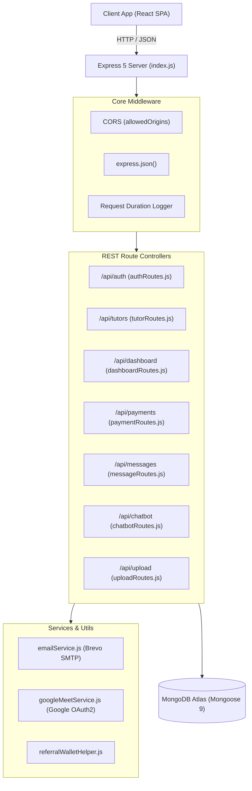

# 🟢 Teach Grow Guide Backend API (Cuvasol Tutor REST Service)

[](https://nodejs.org/)
[](https://expressjs.com/)
[](https://www.mongodb.com/)
[](https://razorpay.com/)
[](https://meet.google.com/)
[](https://www.brevo.com/)
[](https://ai.google.dev/)

---

## 📖 Table of Contents

1. [Overview & Architecture](#-overview--architecture)
2. [Directory Structure](#-directory-structure)
3. [Mongoose Data Models & Schemas](#-mongoose-data-models--schemas)
4. [Complete REST API Reference](#-complete-rest-api-reference)
5. [Core Services & Business Logic](#-core-services--business-logic)
   - [Google Meet & Calendar 2-Way Sync Engine](#1-google-meet--calendar-2-way-sync-engine)
   - [Student Referral & ₹250 Wallet Credit Engine](#2-student-referral--250-wallet-credit-engine)
   - [HR 90/10 Platform Commission & Payout Engine](#3-hr-9010-platform-commission--payout-engine)
   - [Gemini AI Assistant & Contextual Fallback](#4-gemini-ai-assistant--contextual-fallback)
   - [Brevo SMTP Transactional Email Service](#5-brevo-smtp-transactional-email-service)
6. [Environment Variables Reference](#-environment-variables-reference)
7. [Setup & Running Locally](#-setup--running-locally)
8. [CLI Utilities & Database Seeding Scripts](#-cli-utilities--database-seeding-scripts)
9. [Automated Testing & Scenarios](#-automated-testing--scenarios)

---

## 🌟 Overview & Architecture

The **Teach Grow Guide Backend** is an asynchronous Express 5 application built on Node.js 20 LTS. It exposes a modular REST API powering all business logic for Cuvasol Tutor:

* **Authentication & Authorization**: Stateless JWT tokens, Bcrypt password hashing (salt 10), 15-minute TTL signup OTPs, Google OAuth2 social login, and role-based guards (`student`, `tutor`, `admin`, `hr`).
* **Booking & Scheduling**: 1-click free demo bookings, multi-week class packs, universal UTC timestamp persistence, and automatic Google Meet video room generation.
* **Commerce & Ledgers**: Razorpay order initiation, HMAC-SHA256 signature verification, student wallet balance accounting with ₹250 referral credits, and HR 90/10 tutor payout disbursements.
* **AI Support**: Real-time integration with Google Gemini LLM with database-driven tutor search and offline graceful fallback.



---

## 📁 Directory Structure

```text
backend/
├── index.js                    # Express application entrypoint, CORS & DB connection
├── package.json                # Backend dependencies & npm scripts
├── Dockerfile                  # Production container definition
├── .env                        # Local environment variables (gitignored)
│
├── schemas/                    # Mongoose Schemas & Data Models
│   ├── userSchema.js           # User profiles, auth, roles, and wallet history
│   ├── tutorSchema.js          # Tutor profile, dynamic rates, availability, payouts
│   ├── bookingSchema.js        # Bookings, sessions, meeting links, reschedules
│   ├── coursePaymentSchema.js  # AI Future Skills assessment & cohort purchases
│   ├── messageSchema.js        # 1-on-1 direct user messaging
│   ├── signupOtpSchema.js      # 15-minute TTL registration OTPs
│   └── uploadSchema.js         # Uploaded binary file buffer storage
│
├── routes/                     # REST API Route Controllers
│   ├── authRoutes.js           # Registration, login, OTP, Google OAuth & password resets
│   ├── tutorRoutes.js          # Search, profiles, availability, Google Calendar & reviews
│   ├── dashboardRoutes.js      # Student, Tutor, Admin dashboards & HR 90/10 payouts
│   ├── paymentRoutes.js        # Razorpay orders, payment verification & AI assessment
│   ├── messageRoutes.js        # Direct 1-on-1 chat history & thread management
│   ├── chatbotRoutes.js        # Google Gemini AI assistant with live database lookup
│   └── uploadRoutes.js         # File upload and binary stream retrieval
│
├── utils/                      # Helper & Business Logic Modules
│   ├── emailService.js         # Brevo SMTP transport & styled HTML email templates
│   ├── googleMeetService.js    # Google Calendar & Meet OAuth2 client
│   ├── referralWalletHelper.js # Referral bonus calculation and wallet synchronization
│   └── urlHelper.js            # URL sanitization and asset resolvers
│
└── scripts/                    # Admin CLI & Seeding Scripts
    ├── createAdmin.js          # Provision platform admin user
    ├── createHRAccount.js      # Provision HR / Finance user
    ├── seedTutor.js            # Seed mock tutors across Indian cities
    ├── seedCredentials.js      # Seed demo student/tutor credentials
    ├── getAdminRefreshToken.js # Generate Google OAuth2 refresh token
    └── send_profile_completion_emails.js # Bulk reminder email dispatcher
```

---

## 🗄️ Mongoose Data Models & Schemas

| Model | Schema File | Key Fields & Attributes | Description |
| :--- | :--- | :--- | :--- |
| **`User`** | [`userSchema.js`](file:///c:/Users/saira/Downloads/teach-grow-guide/backend/schemas/userSchema.js) | `email`, `password` (Bcrypt), `full_name`, `role` (*student, tutor, admin, hr*), `referralCode`, `referredBy`, `walletBalance`, `walletHistory` | Stores user credentials, role identity, and financial wallet credit balance. |
| **`Tutor`** | [`tutorSchema.js`](file:///c:/Users/saira/Downloads/teach-grow-guide/backend/schemas/tutorSchema.js) | `userId`, `name`, `subjects`, `subjectRates`, `pricingHistory`, `status` (*pending, approved, rejected*), `availability`, `demoSlots`, `googleTokens`, `paymentDetails`, `payoutHistory` | Stores complete educator profiles, dynamic rates, Google OAuth tokens, and banking details. |
| **`Booking`** | [`bookingSchema.js`](file:///c:/Users/saira/Downloads/teach-grow-guide/backend/schemas/bookingSchema.js) | `tutorId`, `studentId`, `subject`, `timing`, `utcTiming`, `status` (*confirmed, enrolled, completed, cancelled*), `meetingLink`, `sessions`, `rescheduleRequest` | Manages scheduled classes, Google Meet links, session statuses, and reschedule workflows. |
| **`CoursePayment`** | [`coursePaymentSchema.js`](file:///c:/Users/saira/Downloads/teach-grow-guide/backend/schemas/coursePaymentSchema.js) | `studentId`, `purchaseType` (*assessment, full_course*), `amountPaid`, `shortlisted`, `assessmentScore`, `assessmentAnswers` | Records AI Future Skills cohort enrollments, entrance assessment answers, and scores. |
| **`Message`** | [`messageSchema.js`](file:///c:/Users/saira/Downloads/teach-grow-guide/backend/schemas/messageSchema.js) | `sender`, `receiver`, `text`, `read` | Direct in-app communication records between students and tutors. |
| **`SignupOtp`** | [`signupOtpSchema.js`](file:///c:/Users/saira/Downloads/teach-grow-guide/backend/schemas/signupOtpSchema.js) | `email`, `otp`, `createdAt` (TTL: 900 seconds) | Ephemeral OTPs for secure registration verification. |
| **`Upload`** | [`uploadSchema.js`](file:///c:/Users/saira/Downloads/teach-grow-guide/backend/schemas/uploadSchema.js) | `filename`, `contentType`, `data` (Buffer) | Direct MongoDB binary storage for avatars and verification certificates. |

---

## 📡 Complete REST API Reference

### 1. Authentication (`/api/auth`)
* `POST /api/auth/send-signup-otp` — Generate and send 6-digit OTP via Brevo SMTP
* `POST /api/auth/register` — Verify OTP and register user
* `POST /api/auth/login` — Login with email/password and obtain JWT
* `POST /api/auth/google` — Google OAuth2 social login
* `POST /api/auth/forgot-password` — Send password reset OTP
* `POST /api/auth/reset-password` — Reset password using OTP
* `GET /api/auth/me` *(Auth: Bearer)* — Fetch current user profile
* `PUT /api/auth/profile` *(Auth: Bearer)* — Update user profile

### 2. Tutors & Bookings (`/api/tutors`)
* `GET /api/tutors` — Multi-filter search (subject, grade, board, mode, city, rating, price)
* `GET /api/tutors/:id` — Get public tutor profile, reviews, and rates
* `POST /api/tutors` — Submit new tutor onboarding application
* `PUT /api/tutors/:id` *(Auth: Tutor)* — Update tutor profile, dynamic rates, and availability
* `POST /api/tutors/:id/book` *(Auth: Student)* — Book free demo or paid class
* `POST /api/tutors/:id/reviews` *(Auth: Student)* — Submit tutor review and star rating
* `POST /api/tutors/google/auth-url` *(Auth: Tutor)* — Get Google OAuth2 consent URL
* `POST /api/tutors/google/callback` *(Auth: Tutor)* — Connect Google Calendar tokens
* `GET /api/tutors/payout/details` *(Auth: Tutor)* — Get saved bank details
* `PUT /api/tutors/payout/details` *(Auth: Tutor)* — Update bank details

### 3. Dashboard & HR Payouts (`/api/dashboard`)
* `GET /api/dashboard/student` *(Auth: Student)* — Student bookings & wallet ledger
* `GET /api/dashboard/tutor` *(Auth: Tutor)* — Tutor schedule, earnings & Google status
* `GET /api/dashboard/admin` *(Auth: Admin)* — Executive platform analytics & KPIs
* `GET /api/dashboard/admin/tutors` *(Auth: Admin)* — Tutor vetting queue
* `PUT /api/dashboard/admin/tutors/:id/status` *(Auth: Admin)* — Approve/reject tutor
* `GET /api/dashboard/hr/payouts` *(Auth: HR/Admin)* — 90/10 commission split ledger
* `POST /api/dashboard/hr/disburse` *(Auth: HR/Admin)* — Log payout & send email receipt
* `POST /api/dashboard/hr/send-bank-reminders` *(Auth: HR/Admin)* — Remind tutors missing bank info

### 4. Payments (`/api/payments`)
* `POST /api/payments/create-order` *(Auth: Student)* — Create Razorpay order
* `POST /api/payments/verify-payment` *(Auth: Student)* — Validate signature & enroll student
* `POST /api/payments/assessment/create-order` — Create order for AI assessment (₹100)
* `POST /api/payments/assessment/verify` — Verify assessment payment
* `POST /api/payments/assessment/submit` — Submit quiz answers & auto-grade

### 5. Messages (`/api/messages`)
* `GET /api/messages/conversations` *(Auth: Bearer)* — List chat threads
* `GET /api/messages/:otherUserId` *(Auth: Bearer)* — Thread history
* `POST /api/messages` *(Auth: Bearer)* — Send direct message
* `PUT /api/messages/mark-read/:otherUserId` *(Auth: Bearer)* — Mark thread read

### 6. AI Chatbot (`/api/chatbot`)
* `POST /api/chatbot/ask` — Query Google Gemini LLM with context

### 7. Uploads (`/api/upload`)
* `POST /api/upload` — Upload multipart file
* `GET /api/upload/:id` — Stream file buffer

---

## ⚙️ Environment Variables Reference

Create a `.env` file in the `backend/` directory:

```ini
PORT=5000
NODE_ENV=development
FRONTEND_URL=http://localhost:8080,https://tutor.cuvasol.com
MONGO_URI=mongodb+srv://<username>:<password>@cluster0.mongodb.net/teachgrow?retryWrites=true&w=majority
JWT_SECRET=your_super_secret_jwt_signing_key_at_least_32_chars
RAZORPAY_KEY_ID=rzp_test_your_key_id
RAZORPAY_KEY_SECRET=your_razorpay_key_secret
SMTP_HOST=smtp-relay.sendinblue.com
SMTP_PORT=2525
SMTP_USER=your_brevo_smtp_login
SMTP_PASS=your_brevo_smtp_password
EMAIL_FROM="Cuvasol Tutor" <support@cuvasol.com>
GOOGLE_CLIENT_ID=your_google_client_id.apps.googleusercontent.com
GOOGLE_CLIENT_SECRET=your_google_client_secret
GOOGLE_REDIRECT_URI=https://tutor.cuvasol.com/google-callback
GEMINI_API_KEY=AIzaSyYourGeminiApiKeyHere
```

---

## 🚀 Setup & Running Locally

```bash
# 1. Install dependencies
cd backend
npm install

# 2. Run in development mode with nodemon
npm run dev

# 3. Start production server
npm start
```

The API will be available at **`http://localhost:5000/api`**.

---

## 🛠️ CLI Utilities & Database Seeding Scripts

```bash
# Create Platform Administrator
node scripts/createAdmin.js

# Create HR / Finance Account
node scripts/createHRAccount.js

# Seed Mock Verified Tutors
node scripts/seedTutor.js

# Seed Standard Test Accounts (Student / Tutor)
node scripts/seedCredentials.js

# Bulk Profile Completion Reminder Emails
node scripts/send_profile_completion_emails.js
```

---

## 🧪 Automated Testing & Scenarios

```bash
# Verify dynamic pricing calculation across historical periods
npm test

# Run multi-student concurrent booking and session simulation
npm run test-multi

# Seed multi-rate scenario for verification
npm run seed-multi
```
